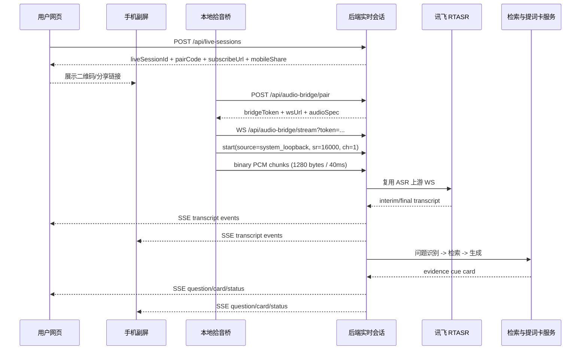
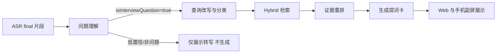

# 基于 program1 的 V1 紧急优化与修改方案

## 执行摘要

这个仓库已经具备一个“本地优先 Web 面试助手”的可用骨架：前端有实时助手、模拟面试、上下文资料、记录复盘；后端有 Fastify、SQLite、SSE 提词卡、讯飞实时 ASR 接口、提示词注册表、多模型 fallback、文档与分块索引表，以及一套从接口测试到浏览器验收的自动化脚本。仓库 README 里把当前主线定义为“导入/确认简历与 JD → 开启实时面试助手 → 识别问题 → 生成提词卡 → 保存记录 → 复盘改进”，并明确当前版本“**不捕获系统音频**”；同时，`speech.ts` 仍然是浏览器麦克风上传到 `/api/asr/xfyun/stream` 的方案，`live.tsx` 也主要围绕“文本输入/浏览器听取 → 生成提词卡”展开。换句话说，**产品定位已经朝实时 Copilot 靠拢，但技术边界仍停留在 Web-only 的麦克风场景**。citeturn2view0turn3view0turn15view5turn6view0turn10view0turn36view0

因此，V1 的“紧急且必须做”不是继续加页面，而是把核心承诺改造成真正可运行的闭环：**Web 主站继续承担账号、岗位、资料、提词卡、复盘和手机副屏；新增一个最小本地拾音桥，先打通 Windows 上腾讯会议/飞书客户端的系统音频 → 后端 ASR → 问题识别 → RAG 检索 → 证据化提词卡 → Web/手机低打扰展示。** 这条路线能最大程度复用现有仓库：沿用 `/api/asr/xfyun/stream`、已有 `documents/document_chunks/document_chunks_fts/retrieval_runs`、`prompt_runs`、`live_cue_sessions` 以及现有 cue-card SSE，而不是推倒重来。citeturn6view0turn36view0turn32view0turn30view0

我的结论是：**P0 只做八件事**。第一，新增 Windows 本地拾音桥与配对机制；第二，新增“实时会话”与音频源抽象；第三，把“自动识别问题”从现在的“final 文本后直接生成”升级为显式的问题识别器；第四，把现有资料上传改造成“上传即索引”的 RAG 入库；第五，把提词卡改成严格的“证据化输出”；第六，增加手机副屏与快捷键，减少面试中切屏；第七，补齐 AI 成功路径与链路诊断；第八，补齐真实成功路径测试，而不是只验证 fallback 可见。三周内，这一版足以把产品从“练习型 Web 工具”抬到“可用于真实线上面试的 V1 Copilot”。citeturn11view0turn28view0turn39view0turn8view0

## 现状审查与设计原则

当前仓库其实已经埋好了 V1 的不少地基。数据库迁移里已经存在 `documents`、`document_chunks`、`document_chunks_fts`、`retrieval_runs`、`prompt_runs`、`live_cue_sessions`、`cue_card_cache` 等表；其中 `document_chunks_fts` 使用 SQLite FTS5，这意味着“项目资料 RAG”的**存储层和全文检索层已经有雏形**，不必在 V1 上来就引入新的外部向量库。SQLite 官方文档也说明 FTS5 是 SQLite 的全文检索虚表模块，适合对文档集合做高效检索。结合仓库依赖里已经使用 `better-sqlite3`，V1 最稳的策略是**先把现有 SQLite/FTS5 用满，再把向量化作为增强层接上去**。citeturn36view0turn37view0turn10view0turn24search0

AI 侧同样不是空白。`server/ai/provider.ts` 已经实现了 OpenRouter → GitHub Models → DeepSeek → LocalFallback 的链式 provider，并且在远端输出非合法 JSON 时，会自动追加一次“请只返回合法 JSON”的修复请求；`server/prompts/registry.ts` 也已经沉淀出 `cueCard`、`mockDecision`、`report`、`resumeChat`、`resumeEvidence` 等 prompt 定义，并为每个 prompt 给出了 `outputSchema`、`guardrails` 和 `latencyTargetMs`。这意味着仓库已经具备“**结构化 AI 输出**”的工程意识，但目前仍是“**先生成文本，再自行 parse/repair**”的方式；如果接入支持 JSON Schema 的结构化输出，就能显著降低实时链路中的解析失败率。OpenAI 官方文档把 Structured Outputs 定义为“保证模型输出符合你提供的 JSON Schema”，而 OpenAI 的模型文档也明确建议：复杂推理用旗舰模型，追求时延/成本用 mini 或更小模型。citeturn8view0turn30view0turn18search1turn18search0

当前最大的产品-技术错位，来自**音频入口**。README 白纸黑字写了“不捕获系统音频”，`speech.ts` 也是浏览器显式点击后调用 `getUserMedia()` 拿麦克风流，用 `AudioContext.createScriptProcessor(4096, 1, 1)` 下采样到 16k PCM，再以 1280 字节块通过 WebSocket 发到 `/api/asr/xfyun/stream`。这条链路适合“练习模式”和“手动文本辅助”，但不够支撑腾讯会议/飞书客户端场景。Windows 官方文档说明，WASAPI 的 loopback 录音可以直接抓取当前播放设备上的渲染音频流；MDN 也说明 `getDisplayMedia()` 必须弹出用户授权与选择器，且能力受浏览器支持限制；Chrome 官方文档则说明 `tabCapture` 只适用于当前标签页，并且必须由用户主动触发。**它们共同说明：纯网页无法稳定、无感地读到桌面会议客户端音频。**citeturn2view0turn3view0turn17search4turn17search0turn25search0turn16search2

测试层面也有一个非常关键的结论：**现有自动化更多验证“有没有 fallback”，而不是验证“AI 成功链路是否真可用”。** `scripts/first-time-user-flow.ts` 直接用 `LocalFallbackProvider` 构建服务；`external-browser-user-flow.ts` 也把“模型提词卡已生成”与“已切回本地练习结果/本地练习/回答框架”都视为通过条件；VAD 相关 404 还被主动忽略。这些脚本对“流程闭环”有价值，但会让“AI 实际没跑通”的问题被掩盖。仓库虽然额外有 `ai-success-smoke.ts`，但它只检查 DeepSeek 成功路径，没有覆盖 OpenRouter/GitHub Models，也没有覆盖本地拾音桥和真实音频输入。citeturn11view0turn28view0turn39view0turn10view0

还有两个容易被忽略但必须在 V1 统一的问题。其一，导出接口存在**命名不一致**：README 写的是 `/api/export` 与 `/api/import`，前端 `apiClient` 也用 `/api/export`，但 `first-time-user-flow.ts` 用的是 `/api/data/export`。其二，当前前端麦克风捕获仍使用 `ScriptProcessorNode`；MDN 已明确把它标为 deprecated，并推荐迁移到 `AudioWorklet`，后者运行在单独的音频处理线程，更适合低延迟实时音频。对于一个实时 Copilot，二者都属于 P0 级别的工程卫生。citeturn2view0turn32view0turn11view0turn38search0turn38search1turn38search8

## 优先级方案

### P0 功能清单与验收标准

下表只列**V1 紧急且必须做**的项目。判断标准很简单：不做它，产品就无法稳定完成“真实会议音频 → 问题识别 → 证据化提词卡 → 记录复盘”的闭环。现有仓库已经具备 ASR、提示词、SQLite/FTS5、SSE 和自动化基础，因此 P0 的思路不是“扩展产品面”，而是**补齐音频入口、实时会话、问题判断、RAG 证据化和可验证的成功路径**。现有基线依据见 README、`speech.ts`、`live.tsx`、迁移脚本、prompt 注册表与自动化脚本。citeturn2view0turn3view0turn15view5turn36view0turn30view0turn28view0

| 功能 | 优先级理由 | 具体修改 | 验收标准 | 替代方案 |
|---|---|---|---|---|
| Windows 本地拾音桥 MVP | 真实腾讯会议/飞书客户端音频无法靠纯 Web 稳定接入 | 新增独立 `audio-bridge` 组件，优先支持 Windows WASAPI loopback，支持可选麦克风混音 | 在 Windows 上，腾讯会议/飞书客户端播放面试官音频时，Web 页 2 秒内出现 interim 文本，10 分钟不中断 | 临时使用 `getDisplayMedia` 作为兜底，仅适合 Web 会议 |
| 实时会话与配对机制 | 需要把 Web、桥、后端、手机副屏绑定到同一场面试 | 新增 live session、pair code、bridge token、会话事件流 | 用户在 Web 点“开始实时助手”，桥输入配对码后 5 秒内完成连接；断线 10 秒内可重连 | 手工粘贴 token，开发快但用户体验差 |
| 问题识别器 | 当前更像“final 文本后直接生成”，误触发会很高 | 在 ASR final/静音边界后先做问题判断，再决定自动生成/待确认 | 常见面试问题 10 题中至少 8 题触发正确；误触发率 < 20%；重复问题不连发 | 完全手动点“生成提词卡” |
| 上传即索引的 RAG 入库 | 现有资料上传已存在，但要形成可检索证据链 | 扩展 `materials` 上传：解析、切块、写入 `documents/document_chunks/document_chunks_fts`，记录索引状态 | 上传 PDF/DOCX/TXT 后可在 30 秒内检索到命中证据；索引失败有明确错误 | 仅保存原文，不索引 |
| 证据化提词卡 | 这是与普通聊天答案最大的差异点 | 提词卡输出必须包含开场句、要点、证据来源、风险提醒、可能追问；证据不足时明确缺口 | 对“项目深挖/经历举例/为什么投递”类问题，卡片中能引用简历或项目资料中的具体证据 | 只输出通用回答框架 |
| 手机副屏与快捷键 | 降低切屏频率，降低面试中操作负担 | 新增副屏 URL/二维码、只读手机页面、键盘快捷键 | 手机扫码 3 秒内打开当前会话；桌面端用快捷键完成确认/切换/聚焦 | 仅保留电脑页 |
| 运行链路诊断与统一错误码 | 现在 fallback 可见，但诊断层级不够系统化 | 统一 bridge/ASR/AI/retrieval 错误码与状态面板；导出端点统一 | 用户和研发都能知道失败点在桥、ASR、模型、还是检索；导出路由一致 | 仅靠 console 和散落提示文案 |
| 成功路径验收测试 | 现有脚本偏向 fallback 成功，不足以上线 | 新增 bridge 集成测试、真实 AI 合约测试、手机副屏测试、长时稳定性测试 | 所有 P0 用例均有自动化与人工 checklist，且 success path 不能被 fallback 替代 | 继续依赖现有 first-user/browser-flow |

### P1 优先级

P1 不是“以后再说”，而是**等第一批真实用户反馈后最该补的增强层**。这里包括三类：其一，macOS 本地拾音桥 Beta，优先基于 ScreenCaptureKit；其二，密集向量检索与混合召回，把现有 FTS5 升级成 hybrid retrieval；其三，说话人分离、问题聚类、卡片去重、公司/岗位联网情报增强。ScreenCaptureKit 官方文档说明它可以捕获高性能音视频内容，并可启用音频捕获；Electron 也说明 macOS 14.2+ 要为 `desktopCapturer` 增加 `NSAudioCaptureUsageDescription`，否则会出现空音频流。因此 macOS 支持应当作为 P1，而不是卡住 P0。citeturn26search0turn26search6turn27search0turn27search11

### P2 优先级

P2 属于产品飞轮：完整桌面外壳、浏览器会议扩展、长期成长体系、订阅计费、公司知识情报包、跨轮次问题复用、Offer 与谈薪支持。这些方向很重要，但它们都建立在 P0 的“真实音频入口 + 实时问题理解 + 证据化提词卡 + 可验证成功路径”已经成立的前提上。否则会变成在不稳定的核心上继续堆功能。现有仓库里已经有 `quota_ledger`、`feedback_tickets`、`audit_events`、`consent_records` 等表，说明商业化与生产治理的地基也已经有了，只是还不到先做的时候。citeturn36view2turn36view3turn37view1

## 技术落地设计

### 实时语音链路

先讲最重要的架构选择：**V1 的本地拾音桥必须直连后端，而不是经网页二跳。** 原因有三个。第一，网页刷新、切路由、标签页休眠时，链路容易断；第二，桥直连后端更容易做断线重连、会话恢复和日志诊断；第三，Web 页与手机副屏只需要消费“会话事件流”，无需承担音频转发职责。现有 `speech.ts` 的 `/api/asr/xfyun/stream` 可以继续复用，但应该从“浏览器麦克风专用路由”升级为“ASR 适配层”，允许桥端输入。讯飞官方文档要求实时转写采用 16k、16bit、单声道 `pcm_s16le`，并建议每 40ms 发送 1280 字节；这与仓库当前 `speech.ts` 的 16k 下采样与 1280 字节切块完全一致，因此可以直接沿用这套音频帧规格。citeturn3view0turn6view0turn16search0turn16search16



P0 的本地拾音桥建议只承诺 **Windows**。理由很现实：Windows 官方明确支持 WASAPI loopback 采集渲染端点音频，适合抓取会议客户端的系统输出；macOS 虽然可以走 ScreenCaptureKit，但权限模型、系统弹窗和长时稳定性风险更高，适合作为 P1 Beta。也就是说，**P0 的商业承诺应该是“Windows 上完整支持腾讯会议/飞书客户端实时辅助；macOS 为 Beta 或仅支持浏览器会议/麦克风模式”。**citeturn25search0turn26search0turn26search2turn27search0

P0 的传输协议建议如下。音频格式固定为 `pcm_s16le`、`16000Hz`、单声道；桥建立 WS 后先发 `start`，随后只发二进制帧；服务端回 `ack/ready/error/ping/pong`。桥每 5 秒发一次 `ping`，服务端 10 秒未见心跳则将 live session 标记为 `bridge_timeout`。如果桥采集中断，Web 端自动降级到“浏览器麦克风”或“文本输入”，沿用现有 `speech.ts` 的 fallback 语义。citeturn3view0turn6view0

**建议的桥端启动消息：**

```json
{
  "type": "start",
  "liveSessionId": "live_01JZ...",
  "captureSource": "system_loopback",
  "sampleRate": 16000,
  "channels": 1,
  "format": "pcm_s16le",
  "meetingApp": "tencent_meeting",
  "platform": "windows",
  "bridgeVersion": "0.1.0"
}
```

**服务端确认消息：**

```json
{
  "type": "ack",
  "streamId": "stream_01JZ...",
  "accepted": true,
  "forwardTo": "xfyun",
  "chunkBytes": 1280
}
```

**统一错误码建议：**

```json
{
  "type": "error",
  "code": "BRIDGE_CAPTURE_DENIED",
  "message": "系统音频捕获权限不足",
  "retryable": false
}
```

P0 延迟目标建议这样定：interim 文本首包 P95 < 1200ms；final 文本在说话结束后 P95 < 2000ms；从 final 片段结束到证据化提词卡可见 P95 < 2500ms；整条“问题触发 → 卡片展示”不超过 4 秒。这个指标对 C 端实时场景已经够用，同时与现有 prompt 注册表里为 `cueCard` 设定的 `latencyTargetMs: 2000` 是一致方向。citeturn30view0

### AI 链路

仓库现在的 `cueCard` prompt 已经在系统层写清楚了“不自动代答、不编造事实、证据不足时明确提示待补充、优先引用 `evidenceIds`”；这是正确方向。问题不在 prompt 价值观，而在**链路粒度还不够清晰**。当前前端更像是“拿到问题就流式要一张卡”。V1 应该强制拆成三段：**问题理解 → 检索 → 生成**。这样才能在每一步都做诊断、缓存和回退。citeturn30view0turn32view0



模型角色建议做成**配置化角色**，不要把 provider 直接写死在业务逻辑里。仓库已经有 provider fallback 链，完全可以扩展成“角色 → 模型池”的映射。如果接 OpenAI，官方当前建议“复杂推理用旗舰模型，时延/成本敏感用 mini/nano”，而 Structured Outputs 又适合问题理解和提词卡生成这种强 JSON 场景；如果继续使用现有 OpenRouter/GitHub Models/DeepSeek 组合，也应让它们遵守同样的角色抽象。**推荐配置是：**问题理解与重排用“小模型”；提词卡生成与复盘用“旗舰模型”；所有结构化步骤尽可能启用 JSON Schema，只有 provider 不支持时才走当前仓库的“repair once”逻辑。citeturn18search0turn18search1turn8view0

**问题理解 prompt 模板建议：**

```text
System:
你是中文实时面试问题理解器。你的任务不是回答问题，而是判断这段文本是否是面试官刚刚提出的问题。
必须只返回 JSON。

User:
岗位标题: {{job_title}}
岗位关键词: {{job_keywords}}
最近 3 条对话: {{recent_history}}
ASR 片段: {{transcript_text}}

请输出:
{
  "isInterviewQuestion": boolean,
  "confidence": number,
  "normalizedQuestion": string,
  "category": "self_intro|project_deep_dive|behavioral|motivation|business|resume_risk|pressure|reverse_question|other",
  "needsEvidenceTypes": ["resume","project","jd","history"],
  "shouldAutoTrigger": boolean,
  "reason": string
}
```

**检索重排 prompt 模板建议：**

```text
System:
你是证据重排器。你不能生成答案，只能从候选证据中挑选最适合支持当前问题的证据。
必须只返回 JSON。

User:
标准问题: {{normalized_question}}
问题类别: {{category}}
候选证据:
{{candidate_chunks}}

请输出:
{
  "topEvidence": [
    {"chunkId":"...", "score":0.0, "why":"..."}
  ],
  "missingFacts": ["..."]
}
```

**提词卡生成 prompt 模板建议：**

```text
System:
你是实时面试回答教练。你必须输出“可讲但不可照读”的提词卡。
只能使用给定证据；证据不足时明确指出缺口，不得编造数字、职责、结果。
必须只返回 JSON。

User:
问题: {{normalized_question}}
岗位信息: {{jd_summary}}
最近对话: {{recent_history}}
已选证据: {{top_evidence}}

输出:
{
  "strategy": "...",
  "openingLine": "...",
  "bullets": ["...", "...", "..."],
  "evidenceIds": ["..."],
  "risks": ["..."],
  "followUps": ["..."]
}
```

在解析层，建议把当前 `provider.ts` 内“先生成 JSON、解析失败再补一轮”的机制保留为兼容策略，但 P0 的目标是优先走**严格结构化输出**。这样能显著减少实时场景里 `fallbackReason` 因为 JSON 不合法而触发。OpenAI 官方文档对 Structured Outputs 的定位正是“确保模型始终遵循 supplied JSON Schema”；对现有链路而言，这意味着**问题理解器与提词卡都应该先 schema 化，再谈提示词优化。**citeturn18search1turn8view0

### 问题识别规则与阈值

当前 `live.tsx` 在自动模式下，会在 `recognizedDraft.lastFinalAt` 更新后等待 450ms 自动触发 `generate()`，同时用 `useMicVAD` 的 `onSpeechEnd` 帮助结束说话。这个实现对练习模式足够，但对真实会议会误触发太多，尤其是寒暄、链接词、半句、ASR 修正片段。V1 应该增加一个显式问题识别器，用规则与轻量模型协同判定。citeturn15view5

建议 P0 规则如下。首先，以 `final` 片段为主，`interim` 只用于 UI 预览；其次，以静音边界 `>=700ms` 或 final 片段累计长度达到 8 秒作为候选分段；再次，计算一个 `triggerScore`。推荐公式是：

- 疑问词命中，如“为什么、怎么、如何、讲讲、介绍一下、你怎么看、举个例子”加 0.25  
- 指令式面试短语，如“说一下你的项目、展开讲讲、你负责什么”加 0.20  
- ASR 片段末尾出现 `？` 或明显疑问语气加 0.05  
- 与 JD/简历高频面试问题模板相似度高于 0.75 加 0.20  
- 小模型判断 `isInterviewQuestion=true` 的置信度乘 0.30  
- 如果片段过短（少于 6 个汉字）减 0.20  
- 如果 12 秒内与上次触发问题的归一化相似度大于 0.88，直接去重

阈值建议是：`score >= 0.72` 自动生成；`0.55 <= score < 0.72` 进入“待确认”，由用户按空格或点按钮确认；低于 `0.55` 只显示在转写区。这个设计比现在的“有 final 就 450ms 后自动生成”明显更稳，而且仍能保留自动模式体验。现有仓库里已经区分 `manual` 与 `auto` 提交模式，因此这套机制可以自然接入。citeturn15view5turn31view0

### RAG 索引、向量化策略与存储建议

V1 的首选方案是：**继续用现有 SQLite + FTS5 作为主检索层，做 Hybrid Retrieval；向量化只预留接口，不在 P0 强依赖。** 这是最符合三周交付目标的路线。理由很直接：仓库迁移脚本已经创建了 `documents`、`document_chunks`、`document_chunks_fts` 和 `retrieval_runs`，而 SQLite FTS5 官方支持全文检索、外部内容表与前缀查询；相反，`sqlite-vec` 虽然很轻量，但项目方也公开写明它仍是 pre-v1，意味着接口可能发生 breaking changes，并不适合当作上线前必须依赖的基础设施。citeturn36view0turn24search0turn23search1

P0 的索引策略建议这样定。文档来源分四种：简历正文、简历证据卡、JD、项目资料。上传资料后，先抽正文与元数据，再切块。中文文档推荐**按 350 到 600 字切块，重叠 80 到 120 字**；标题、段落级 heading、材料类型、上传时间和来源优先级写入每个 chunk 的 metadata。检索时先跑 FTS5，取 top 12；然后按“命中关键词数量 + source priority + recency + 问题类别匹配”做规则重排，取 top 5；如果重排后仍然缺关键信息，再进入生成步骤并在卡片里明确“待补充事实”。这能保证 V1 的主要价值来自“**检索出个人证据**”，而不是“向量搜索是否最先进”。现有 `documents/document_chunks` 结构完全能承载这件事。citeturn36view0turn24search0

向量化建议则做成 **P1-ready 的预留字段**。也就是说，`document_chunks` 可以新增 `embedding_model`、`embedding_dim`、`embedding_blob` 或单独建 `document_chunk_embeddings` 表，但字段实现细节在当前仓库**未指定**。P0 阶段只做 schema 预留，不把线上成功率绑到 embedding 服务上。等真实用户反馈确认“FTS5 + 规则重排”已经不够后，再接入 dense retrieval。这样做的好处是：不影响三周交付，也不浪费现有 SQLite/FTS 的基础。citeturn36view0turn6view2

### 接口设计

现有仓库已经有一批可以直接复用的接口：`/api/asr/xfyun/stream`、`/api/copilot/cue-card/stream`、`/api/mock/session`、`/api/mock/session/:id/answer`、`/api/records`、`/api/positions/:id/materials`、`/api/resume/ai` 等；前端 `apiClient` 还定义了 `AiRunMeta`、`CueCardStreamResult`、`LiveCueSessionTurn` 等结构。这些都说明服务边界已经成形，只差“实时会话”和“本地桥”的接口。citeturn2view0turn32view0turn11view0

**建议新增与调整的接口如下。**

**创建实时会话**

```http
POST /api/live-sessions
Content-Type: application/json
Authorization: Bearer <token>
```

```json
{
  "positionId": "pos_01JZ...",
  "audioMode": "local_bridge",
  "meetingApp": "tencent_meeting",
  "platform": "windows"
}
```

```json
{
  "liveSessionId": "live_01JZ...",
  "pairCode": "824913",
  "pairExpiresAt": "2026-07-08T12:34:56.000Z",
  "eventStreamUrl": "/api/live-sessions/live_01JZ.../events",
  "mobileShare": {
    "shareToken": "ms_01JZ...",
    "url": "/m/live/ms_01JZ..."
  }
}
```

**本地桥配对**

```http
POST /api/audio-bridge/pair
Content-Type: application/json
```

```json
{
  "pairCode": "824913",
  "deviceName": "Emma-PC",
  "platform": "windows",
  "bridgeVersion": "0.1.0"
}
```

```json
{
  "bridgeToken": "bridge_01JZ...",
  "liveSessionId": "live_01JZ...",
  "wsUrl": "wss://api.example.com/api/audio-bridge/stream?token=bridge_01JZ...",
  "audio": {
    "sampleRate": 16000,
    "channels": 1,
    "format": "pcm_s16le",
    "chunkBytes": 1280
  }
}
```

**桥端音频流**

```http
WS /api/audio-bridge/stream?token=bridge_01JZ...
```

首帧 JSON：

```json
{
  "type": "start",
  "captureSource": "system_loopback",
  "sampleRate": 16000,
  "channels": 1,
  "format": "pcm_s16le",
  "meetingApp": "feishu"
}
```

随后发送二进制 PCM 帧；结束时发送：

```json
{
  "type": "end"
}
```

**会话事件流**

```http
GET /api/live-sessions/:id/events
Accept: text/event-stream
Authorization: Bearer <token>
```

SSE 事件类型建议包括：

- `status`
- `transcript`
- `question_candidate`
- `question_confirmed`
- `card`
- `error`
- `done`

**资料上传并索引**

沿用现有 `/api/positions/:id/materials`，但响应体补充索引状态：

```json
{
  "position": { "...": "..." },
  "indexing": {
    "status": "completed",
    "documents": 3,
    "chunks": 47,
    "ftsUpdated": true,
    "warnings": []
  }
}
```

**手动确认候选问题**

```http
POST /api/live-sessions/:id/question-events
```

```json
{
  "segmentId": "seg_01JZ...",
  "action": "confirm",
  "normalizedQuestion": "请介绍一下你在这个项目里主要负责什么？"
}
```

**导出接口统一**

保留 `/api/export` 为标准路径，同时给 `/api/data/export` 做兼容别名；兼容期内返回相同结构，并在响应头加 deprecation 提示。这个统一是 P0，因为仓库当前 README、前端和集成脚本存在不一致。citeturn2view0turn11view0turn32view0

### 关键数据库与对象字段

现有关键表大多来自迁移脚本；新增的实时会话与本地桥表是本方案建议。`server/rag.ts` 当前可见实现细节**未指定**，因此下表只把现有 schema 与建议新增 schema 分开标注。现有表依据见 `001_init.sql`、`002_auth.sql`、`003_user_id.sql`、`006_account_email.sql` 和前端 `src/types.ts`。citeturn36view0turn36view1turn37view0turn37view1turn31view0

| 表/对象 | 状态 | 关键字段 | 用途 | 备注 |
|---|---|---|---|---|
| `documents` | 现有 | `id`, `position_id`, `source_type`, `source_id`, `title`, `summary`, `content`, `priority`, `user_id` | 文档级存储 | 已存在，可直接承载简历/JD/项目资料 |
| `document_chunks` | 现有 | `id`, `document_id`, `position_id`, `content`, `chunk_index`, `priority`, `user_id` | 切块级存储 | 已存在 |
| `document_chunks_fts` | 现有 | `content`, `title`, `source_type`, `source_id`, `position_id`, `owner_key`, `chunk_id` | 全文检索 | SQLite FTS5 虚表 |
| `retrieval_runs` | 现有 | `id`, `query`, `position_id`, `chunk_ids_json`, `latency_ms`, `user_id` | 检索审计 | 已存在 |
| `prompt_runs` | 现有 | `id`, `skill_id`, `prompt_id`, `model`, `provider`, `status`, `latency_ms`, `retrieval_count`, `search_used`, `fallback_reason`, `user_id` | AI 调用诊断 | 已存在，P0 强烈建议复用 |
| `live_cue_sessions` | 现有 | `id`, `position_id`, `json`, `updated_at`, `created_at`, `user_id` | 当前实时提词会话 | 现有但结构偏 JSON blob |
| `InterviewRecord` | 现有对象 | `id`, `positionId`, `mode`, `transcript`, `cueCards`, `speechMetrics`, `report`, `aiMeta` | 记录与复盘 | 前端对象，已健全 |
| `live_sessions` | 新增 | `id`, `user_id`, `position_id`, `status`, `audio_mode`, `meeting_app`, `started_at`, `ended_at`, `last_event_at` | 标准化实时会话 | 当前仓库未指定 |
| `audio_bridge_devices` | 新增 | `id`, `user_id`, `device_name`, `platform`, `bridge_version`, `last_seen_at`, `status` | 设备注册与诊断 | 当前仓库未指定 |
| `audio_bridge_pair_codes` | 新增 | `pair_code`, `live_session_id`, `expires_at`, `used_at`, `created_by_user_id` | Web 与桥配对 | 当前仓库未指定 |
| `transcript_segments` | 新增 | `id`, `live_session_id`, `speaker`, `text`, `is_final`, `start_ms`, `end_ms`, `source` | 实时转写片段 | 当前仓库未指定 |
| `question_events` | 新增 | `id`, `live_session_id`, `segment_id`, `normalized_question`, `category`, `trigger_score`, `status`, `card_id` | 问题识别与确认 | 当前仓库未指定 |
| `mobile_share_tokens` | 新增 | `token`, `live_session_id`, `expires_at`, `revoked_at` | 手机副屏访问 | 当前仓库未指定 |

## 前端交互与低打扰手机副屏方案

前端最重要的变化，不是再加一个页面，而是把现有 `live.tsx` 从“问题输入页”提升为真正的“实时助手驾驶舱”。当前组件已经有监听状态、`manual/auto` 模式、提词卡列表、时间计时器和结束保存逻辑；这很好，说明 Web 主站完全可以继续做主产品承载。P0 需要做的是把顶部控制条改成四个音频源：**本地拾音桥、浏览器麦克风、共享音频、手动输入**；其中“本地拾音桥”应该是默认主入口，“浏览器麦克风/手动输入”是兜底。citeturn15view5turn31view0

页面布局建议固定为三栏。左栏是实时转写与候选问题列表；中栏是当前问题与触发状态；右栏是提词卡。和现在相比，新增的关键不是视觉，而是**状态感知**：已连接桥、桥心跳正常、ASR 正常、问题待确认、提词卡生成中、已引用证据条数、fallback 原因折叠展示。现有 `AiRunMeta` 已经有 `backendStatus`、`fallbackReason`、`evidenceTrace`、`latencyMs`、`retrievalCount`、`searchUsed`，这正好可以被前端完整消费。P0 不应该再让“实时生成失败”只能靠 scattered toast 或控制台观察。citeturn32view0turn15view5

手机副屏建议作为 P0，因为它直接减少了切屏需要，而且仓库已有移动端溢出 smoke test，说明前端对移动视口并非完全没有准备。但当前测试只是检查 `/`、`/live`、`/mock`、`/records` 在 390px 宽度下“不横向溢出”，并不等于已经有可用的手机副屏 UX。P0 应新增一个极简页面 `/m/live/:shareToken`：大字号、深色、只展示“当前问题 / 30 秒回答 / 3 个要点 / 风险提醒 / 上一题与下一题”。它通过二维码从主页面进入，不要求手机登录；访问权限由 `mobile_share_tokens` 控制。citeturn28view0

二维码与配对流程建议完全分离。**桥配对**使用 6 位数字配对码，因为它是“电脑端桥 ↔ 后端”的绑定；**手机副屏**使用二维码/短链，因为它是“网页 ↔ 手机浏览器”的只读共享。一个典型流程是：用户在桌面浏览器创建 live session；桌面页面同时展示“桥配对码”和“手机副屏二维码”；本地桥输入配对码，手机扫码加入副屏；之后桥负责送音频，桌面与手机都只消费会话事件流。这样用户在面试中可以让电脑保持会议界面，把副屏交给手机，不需要反复 Alt-Tab。citeturn25search0turn17search0turn28view0

快捷键必须进入 P0，因为它们比复杂视觉更能降低干扰。建议最少支持这些键位：`Space` 确认“待确认问题”；`M` 开/关当前监听；`R` 手动重新生成当前提词卡；`[` 和 `]` 切换上一题/下一题；`/` 聚焦搜索；`Esc` 收起诊断抽屉。当前仓库已有 `manual/auto` 概念和会话状态机，加入快捷键不会改变业务结构，只是把面试中最常见的交互从鼠标点击收敛到键盘。citeturn15view5turn31view0

还有一个前端 P0 技术项：浏览器麦克风采样应用 `AudioWorklet` 替换 `ScriptProcessorNode`。现有 `speech.ts` 使用的 `createScriptProcessor()` 已被 MDN 标注为 deprecated，而 `AudioWorklet` 运行在单独音频线程，更适合低延迟处理。即便本地拾音桥会成为主路径，浏览器麦克风模式仍然是 fallback 与练习模式的重要支线，因此不应该把它留在过时实现上。citeturn3view0turn38search0turn38search1turn38search8

## 测试计划

仓库已经有不错的测试基础：`verify` 会跑 lint、server typecheck、test 和 build；`test:first-user` 走首次用户全流程；`test:browser-flow` 用 Playwright 跑浏览器验收；`test:ai-success-smoke` 检查 DeepSeek 成功路径。这些都应该保留，但 V1 必须新增“桥接成功链路”的测试层，并收紧现有通过条件。尤其是 `external-browser-user-flow.ts` 目前把“模型生成”和“本地练习”都视为通过，这对上线前排雷是不够的。citeturn10view0turn11view0turn28view0turn39view0

### 端到端验收测试用例

| 用例 | 目标 | 步骤 | 通过标准 |
|---|---|---|---|
| 新用户建档 | 验证注册、引导、岗位创建 | 注册 → onboarding → 粘贴 JD → 进入岗位台 | 账号创建成功；`journeyState` 从 onboarding 到 ready；岗位创建成功 |
| 简历与项目资料入库 | 验证上传即索引 | 上传简历 PDF/DOCX → 上传项目资料 → 等待索引完成 | 返回索引状态 completed；`documents/document_chunks` 数量大于 0；检索能命中资料 |
| 文本模式提词卡 | 验证最低可用链路 | 在 live 页手动输入问题 → 生成提词卡 | 返回结构完整的卡片，含 evidenceIds/risks/followUps |
| 本地拾音桥配对 | 验证桥与会话绑定 | 创建 live session → 桥输入 pair code → 建立 WS | 5 秒内配对成功；桌面页显示“桥已连接” |
| 腾讯会议/飞书系统音频转写 | 验证核心卖点 | 在 Windows 客户端播放会议音频 → 桥抓系统音频 → 后端转写 | 2 秒内出现 interim 文本；10 分钟不中断；错误可诊断 |
| 自动问题识别 | 验证 trigger 质量 | 播放 10 条标准面试问题 + 10 条非问题片段 | 问题识别准确率 ≥ 80%；误触发率 < 20% |
| 证据化提词卡 | 验证差异化价值 | 问“项目深挖/为什么投递/简历风险题” | 卡片必须引用简历/JD/项目证据；证据不足时明确缺口 |
| 手机副屏 | 验证低打扰展示 | 生成副屏二维码 → 手机扫码加入 → 桌面端继续转写 | 3 秒内展示当前问题与卡片；刷新后可恢复会话 |
| 快捷键 | 验证面试中低操作成本 | 用键盘执行确认、重生成、切换、收起面板 | 所有关键动作都可由键盘完成且无焦点错乱 |
| 模拟面试沉淀复用 | 验证资产回流 | 完成一次 mock → 再进 live | mock 里高评分回答可被检索为证据或历史参考 |
| 记录与复盘 | 验证闭环 | 结束 live → 保存记录 → 打开复盘 | transcript/cueCards/report 都存在，且 report 绑定本场会话 |
| AI 成功路径 | 验证非 fallback | 配置真实 provider key → 运行 smoke | cue-card、mock、resume-ai 都必须返回 `success` |
| 导出导入与重启恢复 | 验证数据一致性 | 导出 → 关闭服务 → 重启 → 导入/拉状态 | positions/records/materials/session 历史一致 |
| 部署资源完整性 | 验证 VAD 与静态资源 | 生产构建后访问 `/vad/`、`/onnx/`、关键路由 | 不允许通过测试时再忽略 VAD 资源 404 |

建议把现有脚本改成两层。第一层是“fallback tolerant”的开发通路，保留目前首轮流程测试价值；第二层是“release blocking”的成功路径，明确要求：AI 必须 success、桥必须连通、VAD 资源不得缺、导出路径必须统一。`ai-success-smoke.ts` 已经为真实 provider 成功路径打了样，但它现在只要求 `DEEPSEEK_API_KEY`；V1 应把 OpenRouter/GitHub Models 至少选一个也纳入 smoke，确保 fallback 链不是纸面配置。citeturn39view0turn8view0turn10view0

## 三周里程碑与人日估算

以下估算以“小团队快交付”为前提，默认角色分成后端、前端、本地桥、AI/Prompt、测试五类工作。仓库现有技术栈是 TypeScript + Fastify + React + SQLite，因此 P0 不建议同时开太多新栈；如果团队没有原生经验，Windows 桥可以优先外包为独立最简 helper，或者采用一个极轻的 sidecar 实现，但无论哪种方式，**三周内只承诺 Windows 完整支持**会更稳。现有仓库依赖与脚本结构支持这种增量交付。citeturn10view0turn5view0

### 三周里程碑与人日估算

| 时间窗口 | 目标 | 后端人日 | 前端人日 | 本地桥人日 | AI 人日 | 测试人日 | 合计 |
|---|---|---:|---:|---:|---:|---:|---:|
| 第一周 | 实时会话、配对、Windows 桥原型、材料入库索引、导出路由统一 | 6 | 4 | 7 | 3 | 2 | 22 |
| 第二周 | 桥 → ASR → 问题识别 → 提词卡成功链路，手机副屏首版，快捷键，诊断面板 | 5 | 6 | 6 | 5 | 3 | 25 |
| 第三周 | 稳定性、长时测试、AI 成功 path、桥断线恢复、发布检查与灰度开关 | 4 | 4 | 4 | 3 | 6 | 21 |
| 总计 | P0 完整交付 | 15 | 14 | 17 | 11 | 11 | 68 |

如果团队只有 3 人，建议把范围压缩为 **55 人日左右**：砍掉 P0 中的“共享音频源支持”和“macOS 任何承诺”，只保留 Windows 桥、手机副屏、问题识别器、证据化提词卡和成功路径测试。反过来说，如果团队有 5 人以上，第三周可以把“简历优化与 live 证据共享”做得更完整。仓库现有 prompt、迁移和前端对象设计，已经减少了不少从零开始的工程成本。citeturn30view0turn36view0turn31view0

## 上线风险与缓解措施

最大的上线风险不是“页面不好看”，而是**核心承诺与实际能力不一致**。当前 README 仍明确写着“不捕获系统音频”，而 V1 如果对外主打“自动听面试官”，那就必须同步更新帮助文档、权限说明、同意条款和数据处理说明。好消息是，迁移里已经有 `consent_records`、`audit_events`、`feedback_tickets`、`mail_outbox` 等表，说明你已经为生产治理预留了基础。P0 应把“系统音频捕获同意”“转写同意”“资料上传用于 RAG 检索同意”写成单独 consent 版本，并在 live session 启动前记录。citeturn37view1turn36view3

第二个风险是**Windows 成功、macOS 翻车**。这不是实现质量差，而是平台权限模型决定的。Windows 的 WASAPI loopback 官方就支持直接抓取渲染端点音频；macOS 侧无论走 ScreenCaptureKit 还是 Electron `desktopCapturer`，都涉及系统级权限、屏幕/音频捕获许可以及更复杂的系统交互。Electron 文档还明确说明，macOS 14.2+ 缺少 `NSAudioCaptureUsageDescription` 时可能直接产生空音频流而没有明显警告。因此，V1 公开承诺里必须把平台支持矩阵写清楚：**Windows 全量支持，macOS Beta/未指定。**citeturn25search0turn26search0turn27search0turn27search11turn27search15

第三个风险是**AI 表面可用，实际一直 fallback**。当前 provider 设计很合理，但如果不把成功路径写进发布阻断条件，系统会不断依赖 LocalFallback 而不自知。`provider.ts` 已经把 fallback reason、provider、raw 响应和一轮 repair 机制做出来了；`prompt_runs` 和 `AiRunMeta` 也有足够的 observability 字段。P0 要求是：上线监控必须看到 success rate、schema failure rate、retrieval empty rate、bridge timeout rate、ASR upstream error rate，而不是只看接口 200。否则“AI 没跑通”会在 C 端真实流量里被放大。citeturn8view0turn36view0turn32view0

第四个风险是**Web 端与测试端继续掩盖问题**。现在浏览器验收会忽略 VAD 资源相关 404，并把 fallback 文案也当通过；这在研发阶段没问题，但在发布阶段必须切换成强约束。尤其是 `speech.ts` 当前还依赖 VAD 资源和浏览器音频能力，如果生产构建把 `/vad/` 或 `/onnx/` 漏掉，现有脚本不会拦。P0 上线前，必须增加一轮“生产构建 + 实际静态文件路径 + success-only 验收”。citeturn28view0turn3view0

最后一个风险是**RAG 复杂化过早**。仓库已经有 `documents/document_chunks/document_chunks_fts/retrieval_runs`，SQLite FTS5 也足够完成 V1 的“证据找得到、卡片有出处”。如果现在强行把 embedding、外部向量库、多阶段重排一起上，会显著增加上线前的不确定性。更稳的做法是：P0 先把 FTS5 + metadata rerank 做深，P1 再为 dense vector 预留字段接上。`sqlite-vec` 的确轻量，但它仍处于 pre-v1，恰好说明它不适合作为这三周内必须依赖的生产核心。citeturn36view0turn24search0turn23search1

综合来看，V1 的正确目标不是“把所有求职功能都做全”，而是把最核心的一句话变成事实：

**在 Windows 上，用户把腾讯会议或飞书面试开起来之后，产品能稳定听到面试官问题，快速抓到与简历、JD、项目资料相关的证据，并在低打扰界面上给出可信、可讲、可追问准备的提词卡。**

这句话里涉及的每个环节，当前仓库都已经有一部分基础；P0 的价值，就是把这些基础连接成一个**真正可上线的成功路径**。citeturn2view0turn3view0turn36view0turn30view0turn28view0