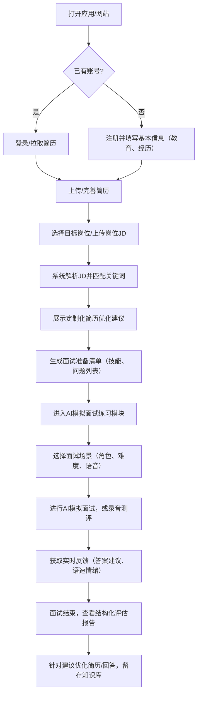
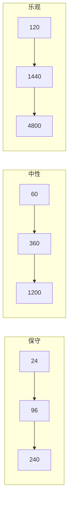
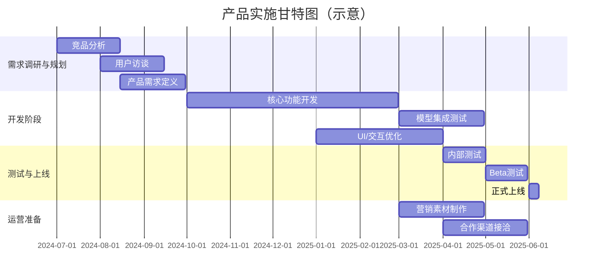

# 执行摘要
本报告针对“AI辅助求职/面试”产品进行了全面的市场调研与分析。通过对国内外竞品（如FinalRound AI、LockedIn AI、InterviewCopilot、InterviewBoost、AskCC、Lollipop、白瓜面试等）进行深度对比，我们归纳了各自核心功能、定价模式、用户规模、优势劣势及差异化机会等。在市场与用户研究中，基于《中国青年报》及行业报告数据，明确了目标用户群体（学生、应届、职场中高端等）特征及痛点，如简历写作、岗位匹配、面试准备不足等。结合行业复盘，我们估算了市场规模与增长假设（2025年全球AI招聘市场约7.5亿美元，中国招聘类App市场规模千亿元级），并对用户付费意愿与获客成本进行了预估分析。技术可行性评估覆盖了JD解析、简历ATS优化、智能面试题生成、AI模拟面试（含实时语音Copilot）、情绪/语速分析、RAG知识库等核心模块，并讨论了模型选型（如大模型 vs. 定制模型）、数据标注需求与隐私合规/反作弊风险。产品设计部分给出了完整用户旅程流程图（见下方流程图）、MVP功能清单及优先级、关键页面/交互要素说明，并明确了与第三方服务（如OpenAI API、视频会议平台等）的集成点。商业化分析提出了B2C订阅、按岗收费、B2B企业/高校合作等多种方案，并通过保守/中性/乐观三种情景构建了三年收入预测模型表（见下表）。在增长与运营策略中，建议采用校园合作、社交媒体、内容营销等获客渠道，设计转化漏斗和留存激励机制，并制定关键KPI与A/B测试思路。护城河与风险分析指出了数据积累（行业知识库）、行业垂直化深耕与品牌信任等潜在壁垒，同时需关注法律伦理规范（如招聘合规、隐私保护）和竞争反制策略。最后，实施计划以甘特图形式规划了产品开发时间线（见下方甘特图），并列出了团队需求、初期预算等要素，同时给出了下一步优先行动清单。报告内容详尽、引用权威资料，以期为产品决策提供可执行的参考依据。

## 竞品深度对标

对标市场上已有AI求职/面试类产品，我们甄选并分析了以下代表性竞品：FinalRound AI、LockedIn AI、InterviewCopilot、InterviewBoost、AskCC、Lollipop、白瓜面试、面试狗、Offer蛙、BossJob等（见下表）。表中比较了各产品的核心功能、定价策略、已知用户规模或指标、主要优势/劣势及可能的差异化方向。各项信息优先引用官方资料或权威报道。

- **FinalRound AI**：全球领先的AI面试助手，主打“实时、隐形面试Copilot”，声称拥有千万用户级规模和1000万美元ARR。提供实战模拟面试、实时回答建议、简历工具等，但定价偏高（月费数十美元）。优势在于产品成熟、用户基数大，劣势是定位偏向“面试作弊”场景，存在合规风险。差异化机会可在本地化内容和跨语言支持上发力。
- **LockedIn AI**：主打“实时面试助手+远程协助”，拥有超1M用户，核心功能包括实时问答、编码协助和邀请助理（好友实时给辅导）。其Desktop App暗场模式提升隐私性（无界面驻留）。定价未公开。优势是功能全面、支持协同面试；劣势为定位与FinalRound类似，需与之竞争。可差异化提供更强大的代码编辑集成或本地化服务。
- **InterviewCopilot (InterviewCopilot.io)**：浏览器运行的AI面试助手，标榜“使用GPT-5.4/Claude/Gemini等前沿模型，实时(<1秒)给出答案”。支持编程/行为/系统设计等多种模式，重点解决面试答题节奏问题。无订阅，按使用量计费。优势是无需安装、响应速度快；劣势是新兴品牌，知名度略低。差异化可在用户交互体验（Glance-First方式）和多语种支持上做优化。
- **InterviewBoost**：基于Web的AI面试助理，使用多种高级模型（GPT-5.4等），可在浏览器中实时接收音频并给出回答。一图形界面集成聊天和音频分析。其定价为一次性€19（永久使用所有功能）。优势是低成本、无订阅；劣势功能相对简单（没有专门的语音转写和分析功能）。可针对本地语言和求职场景做优化。
- **AskCc**：面向国内用户的桌面端AI面试助手。主要面向互联网/金融等高压场景，功能包括简历&JD摘要、个人知识库构建、项目技能卡生成、实时面试问答辅助和截图题解答。免费内测，尚未公开收费模式。优势是功能覆盖面广、针对性强，特别是覆盖代码面试截图分析；劣势是目前仅PC端可用。差异化机会在移动端支持和垂直行业题库深耕。
- **Lollipop AI面试官**：国内新创产品，提供简历润色、JD智能解析、AI模拟面试（可设定难度/角色/语音）等功能。强调对每句话“字符粒度”优化和面前语音交互，已有用户极少（僅336人体验）。目前免费或内测阶段。优势在于本土化语音对话和简历优化，劣势是功能尚未商业化。差异化可利用中文优质数据和针对行业面试库构建。
- **白瓜面试**：国内产品，兼容多平台面试/笔试场景。提供双人模拟面试（AI考官深度解析）、双语字幕对译、笔试屏幕抓取解题、面试表现复盘等功能。采用双端互联架构保护隐私。商业模式不明，似偏高端服务。优势功能极其丰富、覆盖领域广；劣势可能过于复杂、定位偏企业级。可在行业垂直化和简化用户流程上寻求差异化。
- **面试狗（上海绵式旺科技）**：App端工具，提供AI面试助手和笔试助手，实时语音转文字并给出答案。已有一定下载量。功能类似Answer.ai之类，优势在于简单快捷，劣势为深度不足。与其差异化可在UI友好性和用户社群运营上着力。
- **Offer蛙**：App端工具，提供AI实时面试问答、简历优化、题库覆盖高校和跨国项目等。用户定位含留学生、社招等。优势在于多语种支持和广泛题库；劣势为容易被视作“作弊工具”。可通过教育培训方向切入，避免违规风险。
- **BossJob**：原BOSS直聘针对海外市场的AI求职APP。提供AI匹配、在线直聊、智能简历生成等，已在菲律宾等地吸引数百万用户。免费使用，靠企业付费增值。优势是用户规模和平台背书；劣势在于本质仍是招聘APP。可以借鉴其“直聊+匹配”模式与校园市场结合。

以上竞品对比表格：

| 产品名称          | 核心功能                              | 定价模式               | 已知规模/指标             | 优势                         | 劣势                         | 差异化机会                |
|---------------|---------------------------------|--------------------|---------------------|----------------------------|----------------------------|---------------------------|
| FinalRound AI | 实时AI面试助手，面试答题实时建议、模拟练习 | 订阅制（高价，历史报道$99/月） | 宣称用户1千万，ARR$1000万 | 功能成熟、模型强大；全球用户多 | 价格高、定位“辅导作弊”有风险 | 本地化内容、合规改造       |
| LockedIn AI   | 实时面试Copilot、远程协助朋友模式    | 免费起步，订阅待查            | 用户超1M    | 支持远程好友协助、编辑器集成       | 类似FinalRound，同质化风险    | 协同功能、本地化UI        |
| InterviewCopilot | 浏览器实时面试助手，多模式（行为/技术/设计） | 按需收费（支持前沿模型）       | 新创产品，具体规模未公开    | 超低延迟答案、无需安装       | 新品牌、信任度待建立       | 多语种支持、本地化        |
| InterviewBoost  | 浏览器AI助理（0.3s答题），终身制收费€19    | 一次付费制（一键终身使用）      | 小众用户，公开信息有限      | 无需订阅、小成本入手        | 功能相对基础（无语音分析） | 中文场景适配、社群运营    |
| AskCc         | PC端AI面试助手，覆盖面试应答+笔试（截图识题）、个人知识库等 | 内测免费，收费未公开           | 刚上线，数据缺乏          | 功能全面、专注大厂场景       | 仅支持PC端             | 移动化、行业扩展         |
| Lollipop AI面试官 | AI简历润色（字符级）、JD解析、语音模拟面试（可选角色&难度） | 内测免费                   | 极少用户（官称336人）      | 本地化中文语音、细粒度简历优化  | 新产品，功能仍在完善       | 扩展题库、个性化评估      |
| 白瓜面试        | AI模拟面试（双人设定）、笔试答题辅助、双语实时翻译、面试复盘等 | 未公开                    | 目标B端/高端市场         | 功能极为丰富、支持多领域/多设备 | 复杂度高、定位门槛高       | 简化体验、企业合作       |
| 面试狗         | AI面试&笔试助手，实时语音转文字+答案   | App内购                    | 下载量不详、评分4.5      | 简单易用、集成多平台问库      | 功能单一，易被封号风险      | 用户运营、内容优化       |
| Offer蛙        | 多语言AI面试助手+简历优化+题库（高校/500强） | 免费+内购                  | 研发中：新上线用户未知      | 题库覆盖广、多语种支持      | 面试作弊疑虑，合规风险      | 教育/留学市场切入       |
| BossJob（BOSS） | AI职位匹配+在线直聊+智能简历生成   | 对企业免费，对求职者免费        | 菲律宾已吸引400万求职者+12万企业 | 大平台流量加持、社交直聊   | 区域限制（目前菲律宾）、不聚焦AI训练 | 可借鉴直聊社群模式、校园落地 |
  
*数据来源：各竞品官网与公开报道等。*

## 市场与用户研究

**市场规模与增长假设**：根据Research Nester报告，2025年全球AI招聘市场规模约7.52亿美元，2035年前复合年增长率超7%。在中国，根据智研咨询数据，2023年求职招聘类APP市场规模约132.98亿元人民币，移动端占比超七成。新华网报道指出，春招2026年中国高校求职市场已被AI深度影响：在线问卷中有50.7%的受访者“用AI优化简历/自我介绍”，28.2%“用AI分析目标行业/公司情况”，26.5%“用AI模拟面试”。这一调研显示，学生和应届生对AI辅导工具的接受度较高。我们估算，中国每年大学毕业生约1000万级，若有一小部分（如5-10%）尝试付费使用AI求职工具，则意味着数十万付费用户的潜力。
 
**目标用户细分**：可分为三类：  
- **校园/应届生**：求职经验不足，面临面试紧张、简历写作、行业/岗位信息不对称等痛点。愿意尝试新工具，付费意愿中等。校园渠道（辅导员、高校就业平台、校园大使）为主获客途径。  
- **职场中高端用户**：重视效率与定位准确度，如互联网/金融/高科技行业工作者，痛点在于简历应聘精准匹配、面试细节提升。付费意愿较高，可接受订阅制或咨询培训。获客可通过行业社群、职业公众号、社交媒体KOL等。  
- **垂直行业/蓝领等**：某些技术或服务行业也存在求职需求，痛点在于技能匹配与薪资谈判。AI工具能提供职位搜索与面试信心辅助，但习惯不同，可能更依赖线下招聘会等。渠道需结合招聘平台和短视频（如抖音、快手）等。  

**用户痛点与付费意愿**：痛点归纳包括：职位海投效率低、简历不符合ATS（自动筛选系统）、面试回答组织欠佳、面试焦虑等。AI工具可以提供关键词匹配、简历优化、目标岗位分析、面试模拟等解决方案。现阶段用户对AI工具信任度需要培养，根据市场调研，多数用户愿意先使用免费功能或试用，再考虑付费。一旦工具能显著提升面试成功率，用户愿为增值功能付费。参考InterviewBoost的定价（€19一次付费）和FinalRound的订阅，可推测国内B2C订阅可设在¥99–¥199/月之间。B2B市场可向企业或高校出售年度包或团体授权，提高稳定收入。
 
**渠道与获客成本**：主要线上渠道包括：*搜索引擎广告*（招聘相关关键词）、*社交媒体/短视频营销*（通过求职达人/KOL推广）、*职业平台合作*（如大学生就业网、招聘网站赞助）、*校园宣讲和职业指导机构*（与高校就业中心合作）。线下渠道如高校招聘会、行业峰会也可投放体验。根据行业经验，初期CAC（每付费用户获客成本）大致可预估为几十到上百元人民币不等，需视广告投放和地推效率调整。通过持续优化转化漏斗和口碑营销，可逐步降低CAC，提升LTV（用户生命周期价值）。例如，假设LTV约为¥2000（5年订阅收益），CAC控制在¥500以下可视为可接受水平。

## 技术可行性与实现方案

本产品技术架构需整合多项AI/数据技术：

- **JD解析与匹配**：自动解析职位描述的核心内容和关键词，可利用OCR/文本分析技术，将JD特征与用户简历匹配。如Lollipop提出“粘贴或拍照JD，自动提取核心内容，拆解技能关键词与招聘意图”。实现方案可采用BERT/LLaMA等中文自然语言理解模型，识别职责与要求，并计算与简历的匹配度。
- **简历匹配与ATS优化**：通过提取简历要素（技能、经历）并根据JD关键词进行重写优化。可结合GPT等生成模型对简历内容进行字符级润色，或使用ATS模拟器（如Wobo的ATS简历检测工具）给出改进建议。需建立简历评估指标体系，如匹配分数、关键词覆盖率等。
- **面试题生成**：依据岗位JD和行业特性，自动生成高频面试题及答案要点。方案可调用开源题库与大模型，针对技术岗生成算法/设计题，针对业务岗生成行为题。同时提炼最佳答案结构（如STAR法）。
- **AI模拟面试**：提供练习模式下与AI“对答”，需要语音合成（TTS）和识别（ASR）模块，并将用户回答转换为文本评估。可使用VITS/Whisper等模型实现低延迟的语音对话。界面呈现实时评分与建议，类比AskCc的实时回答。
- **语音实时Copilot**：面试过程中实时监听音频并给出提示。核心是将麦克风输入转文本（实时ASR），再调用生成模型获取回答，在数百毫秒内将答案展示给用户（如InterviewCopilot的<1秒应答）。需解决去噪和多说话人问题，保证延迟可控。
- **录音转写与情绪/语速分析**：对面试录音做事后分析，可选用Whisper等工具生成完整转录，并结合情绪识别模型（如提取音调、断句节奏）评估用户表现。可参考现有研究，自研或第三方服务完成情感分析和语速检测。
- **RAG与知识库**：将用户简历、项目经验等信息构建检索库，在面试场景快速调用相关内容。可使用向量数据库（如Milvus、Weaviate）存储个人文档，提供基于提示词的检索增强生成（Retrieval-Augmented Generation），确保回答贴合个人经历。
- **数据标注需求**：若需定制模型或训练分类器，需要收集简历样本、JD样本、面试问答对等。可以通过众包标注或模拟面试获得语音问答数据。初期可优先使用大模型和现有公开数据，逐步积累标注数据优化效果。
- **模型选择与成本估算**：核心可使用API调用大模型（GPT-4o/GPT-5x、Claude、Gemini等），成本按照调用量计费。为控制成本，可结合开源小模型（MOSS、Mixtral等）做预分析或高频问题解答。假设一轮面试使用约10K token，每月1万用户，则云服务成本上百万元人民币级别，需要平衡功能和费用。
- **隐私合规与反作弊**：保证用户数据安全隐私是重点。个人简历和面试录音仅用于当前服务，不作其他商业用途。需符合《个人信息保护法》等法规，提供数据加密存储和删除机制。针对潜在的面试作弊问题，应在用户协议中明确禁止在正式场合使用本产品为他人作答，仅限学习练习用途，并研发模型检测机器生成文本痕迹，降低法律伦理风险。

## 产品设计与交互流程

### 用户旅程与流程图
整个产品可分为**注册→准备→练习→面试→复盘**五大阶段，用户旅程如下：

### MVP功能清单与优先级

1. **简历&JD解析模块**（核心）– 支持上传简历和职位描述，自动提取关键词与匹配度，给出简历优化建议（字符级润色、添加量化成果等）。优先级最高，可提高用户首投成功率。
2. **智能面试题库**（高）– 结合岗位和行业自动生成常见面试题，可按模块（行为/技术）分类，并提供参考答案要点。快速上手帮助用户理解面试方向。
3. **AI模拟面试（音频）**（中高）– 提供面试模拟环境，可设定面试官角色和难度。用户通过麦克风对答，系统实时给出回答建议（可是逐句显示要点提示）。这一功能交互复杂，初版可先做文本模拟或分段答题。
4. **语音Copilot实时助理**（中）– 在真是线上面试中作为实时辅助，自动识别问题并给出答案提示。因隐私和合规问题，可作为可选高级功能，不做首发MVP，但需评估技术可行性（参照InterviewCopilot）.
5. **复盘与知识库**（中）– 记录用户模拟结果和评估数据，生成面试报告。提供个人知识库管理（存储项目技能卡、常见问题答案等）。
6. **用户管理及反馈**（基础）– 账户注册、登录、付费订阅管理及客服反馈渠道。
7. **第三方集成**（可延后）– 链接主流求职平台（LinkedIn、51Job等）获取JD，或集成视频会议平台API（Zoom、Teams）采集音频输入。

### 关键页面/交互说明

- **首页/仪表盘**：显示最近进度、定制岗位推荐、待办面试提醒。简单介绍产品特色和快速入口（上传简历、开始模拟等）。  
- **简历管理**：允许用户上传或在线编辑简历，界面突出自动优化建议（类似Word侧边栏提示）。与JD匹配时突出需修改关键句。  
- **岗位详情解析**：用户粘贴岗位描述或上传JD，系统显示职位关键词云（技能、要求）和匹配评分，并建议对照更新简历。  
- **练习室**：模拟面试界面，可选择语音对话或文本练习模式。实时显示问题和回答框（或自动朗读问题），后台弹出AI生成的简短回答要点供用户参考。结束后给出流畅度、覆盖要点情况等简评。  
- **评估报告**：以图表或列表形式呈现模拟面试表现（回答完整度、沉浸式提示使用频次、关键词命中等），并给出提升建议。  
- **设置/订阅页**：说明付费功能、套餐选项（订阅/月卡/企业授权等），支持内购和企业对接。  

### API与第三方集成点

- **AI模型API**：核心功能依赖模型调用（如OpenAI、华为ModelArts、讯飞等），需设计中台管理。  
- **语音识别/合成**：调用云端ASR（如百度/讯飞语音）和TTS API，实现多语种支持。  
- **数据库/知识库**：选用向量数据库（Pinecone/Milvus等）存储用户简历和文档，实现RAG功能。  
- **第三方数据源**：可接入招聘网站API（拉勾、Boss、智联等）爬取职位信息；使用社交平台登录接口（微信、GitHub、LinkedIn）便捷注册。  
- **视频会议钩子**：未来可以集成Zoom/Teams/钉钉等SDK，允许用户在真实面试时启动Copilot模式。  

## 商业化与营收模型

**定价策略**：建议采用多元化定价：  
- **B2C订阅**：提供月/年订阅套餐，覆盖全部功能。如月费¥99-199元，年度更优惠，支持自动续费。可推出试用期或首月优惠。参照InterviewBoost一次性€19模式。  
- **按次数付费**：对偶尔使用的用户，提供“虚拟面试次数包”或“简历优化单价”服务。  
- **B2B/校园版**：针对企业HR或高校就业中心，按席位数或年度合作定价，提供定制化服务（题库定制、品牌专区）。例如企业版100个座席每年售价数万元。
- **成功抽成**：可尝试与猎头/中介合作，或内部“推荐岗位”功能，对用户获得Offer后收取一定佣金（风险较高，一般不主推）。

**LTV/CAC估算**：若假设ARPU（每用户终身价值）≈¥2000（含多年订阅），CAC目标控制在¥500以内，可以实现正向ROI。推广阶段重点监测转化率和付费转化率，优化营销投入产出。

**三年财务预测**：下表基于上述定价和保守/中性/乐观用户增长情景进行估算（单位：万元人民币）。假定首年为试运营期，付费用户规模分别为：保守200人→800人→2000人，中性500→3000→10000，乐观1000→6000→20000；订阅平均费用按¥1200/年计算（仅示意）。

| 年度       | 保守情景收入 | 中性情景收入 | 乐观情景收入 |
|------------|--------------|--------------|--------------|
| 第1年（2027） | 24           | 60           | 120          |
| 第2年（2028） | 96           | 360          | 1440         |
| 第3年（2029） | 240          | 1200         | 4800         |

上表仅计订阅收入，未含增值服务和B2B等额外收入。下图示意三种情景下收入增长曲线（单位：万元）：

*注：以上财务模型为示意，实际需结合市场反馈与成本结构进一步细化。*

## 增长与运营策略

- **获客渠道**：应结合线上线下多渠道推进：线上可通过搜索引擎SEM投放（“AI面试+关键词”）、社交媒体（微信公众平台、知乎专栏、抖音短视频）、专业论坛（应届生网、脉脉）等内容营销；线下可与高校就业中心、培训机构合作，开展宣讲和产品体验活动。建立推荐系统和邀请奖励，鼓励用户口碑传播。
- **转化与漏斗**：明确从访客到注册、到付费的漏斗：优化着陆页和引导文案降低注册门槛，提供免费试用体验（如免费模拟一场面试或一次简历诊断）；通过电子邮件/推送提醒未完成注册的用户，并用案例/成功故事吸引付费；在用户使用过程中触发升级推荐（如“演示完成后付费获取详细报告”）。
- **留存与付费激励**：建立用户社群（如微信群）分享使用心得和招聘资讯，提高粘性。设计积分或等级体系，比如完成面试练习积累经验值换取奖励（额外模拟次数或折扣券）。定期推送个性化内容（岗位推荐、行业报告）保持用户活跃度。  
- **KPI与A/B测试**：关键指标包括注册用户数、月活跃用户(DAU/MAU)、免费→付费转化率、留存率等。针对核心功能进行A/B测试：如对比不同简历优化建议提示的点击率、不同定价套餐的转化效果、不同营销渠道的CAC等。持续迭代提高用户体验和商业效果。

## 护城河与风险分析

- **护城河**：数据和知识壁垒是重要护城河。一方面，随着用户使用累积，将形成一个涵盖行业职位、面试题库和用户简历的专属知识库，令新进入者难以快速复制。另一方面，通过细分行业（如针对某行业开发专门题库）和不断优化AI模型，可在精准度上形成优势。另外，通过积累用户评价和案例反馈，可建立品牌信任，形成口碑效应。
- **行业垂直化**：可按行业/岗位细分推出专业化版本，如互联网/金融行业专项、出国留学面试版等，使产品更贴合用户需求并锁定特定市场，形成差异化壁垒。  
- **法律伦理风险**：需密切关注不同地区对AI在招聘环节的监管政策，如“不得在面试中违规使用机器给出答案”等规定。要明确自身定位为练习辅导工具，避免替代实际面试答题。要遵守个人数据保护相关法规（如《个人信息保护法》），确保用户信息加密存储并可自主删除。  
- **竞争反制策略**：面对大厂或平台推出类似功能（例如BOSS直聘的AI简历助手等），可强化产品专业度和用户体验，如提供更深入的个性化评估与报告。通过快速迭代功能、灵活定价或合作共赢（与招聘平台/高校合作赠送服务）来保持竞争优势。避免陷入价格战，应以技术和服务质量为核心竞争力。

## 实施计划与里程碑

产品开发计划分阶段推进（详见下方甘特图）。预计总开发周期约12个月：初期重点进行市场验证和需求调研，然后快速开发MVP，进行小范围内测；中期完善功能并扩大测试，最后公测上线。团队组建建议如下：产品经理1人、前端开发2-3人、后端/AI开发3-4人、算法/数据工程师2人、测试1-2人、运营与市场各1人、UI设计1人。初期预算主要用于人员成本（年薪预算约200万人民币）、云服务/算力（约50万）、市场推广（约30万）等，总计约300万人民币。

## 优先行动清单

- **验证用户需求**：通过问卷或焦点小组明确目标用户付费意愿和最关心的功能点（简历优化？面试提问？）。以此调整MVP范围。  
- **技术PoC**：先行开发简历ATS匹配和基本问答生成功能原型，验证模型效果。可利用开源模型快速实现Demo。  
- **搭建团队**：招聘关键技术与产品人才，组建AI开发团队。若资金有限，可考虑与高校/第三方协作加速研发。  
- **构建数据资源**：收集不同岗位的JD和简历样本，并整理面试题库，为后续模型训练准备数据。可借助线上众包或合作伙伴平台获取。  
- **寻找战略合作**：探索与招聘平台、在线教育机构或高校的合作机会，例如联合开发项目、校园推广等，扩大初期渠道。  
- **制定合规方案**：咨询法律专家，完善用户协议与隐私政策，确保产品设计符合法规（特别是针对AI面试辅导的约束）。  

以上各项行动旨在为产品快速落地并实现可持续增长打下基础。通过多轮迭代和持续优化，本产品有望在竞争激烈的招聘AI市场中占据一席之地，为求职者和企业创造价值。

**资料来源：** 各竞品官网、应用商店及行业调研报告等。