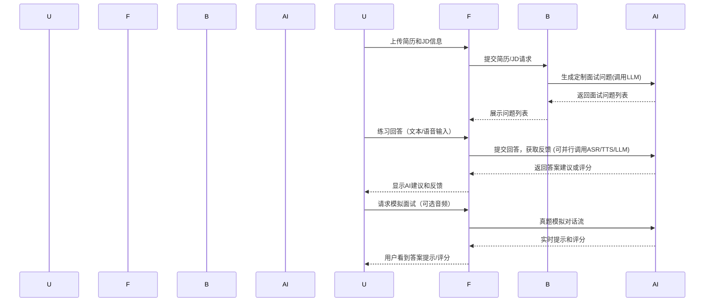

# 执行摘要

本文针对从0到1开发“AI辅助求职/面试”产品的前期工作进行了全面研究和分析。我们首先通过调研Final Round AI、InterviewOra、AskCc、Lollipop、Offer蛙、Boss直聘等竞品，梳理了行业痛点和可行性：这些产品普遍提供基于简历和职位描述的问答生成、简历优化、AI模拟面试以及实时面试辅导等功能。市场方面，BusinessInsider报道AI求职助手正成为趋势，OptimHire等创业公司已获千万美元融资，并与Monster等平台合作；ZipRecruiter数据也显示，使用AI求职的用户获得Offer数量翻倍。因此，需求明确、发展空间广阔。

报告分为以下模块：**产品需求文档**（明确目标和范围）、**功能设计与优先级**（列举并排序核心功能）、**用户画像与付费模型**、**竞品对标矩阵**、**差异化与护城河**（强调本产品独特性）、**系统架构与关键接口示意**、**技术栈与数据策略**、**隐私合规与伦理风险**（包含实时面试作弊的法律道德评估）、**MVP范围与开发里程碑**、**人员与预算**、**运营增长策略**、**定价与财务预测**（包含三年收入成本模型及敏感性分析）、**KPI与A/B测试方案**、**风险与应对**、**投资人关切与融资建议**等。每项均说明目的、交付物（含模板示例）、优先级、责任角色、工时/成本预估及验收标准。本文通过表格、Mermaid图和数据分析，力求详尽、严谨，方便产品、技术、运营和投资团队在开发前直接采用。

## 1 产品需求文档（PRD）

**要点：** PRD用于定义产品目标、功能和特性，对齐所有利益相关者并指导开发。  
- **目的：** 明确产品定位、核心用户需求和功能范围，形成可执行的开发蓝图。  
- **交付物：** 标准PRD文档。可参考模板大纲：  
  ```
  # PRD 文档模板大纲示例
  1. 产品概述与背景：目标用户、市场痛点、竞争格局。
  2. 产品目标与关键指标(KPI)：需要解决的问题和衡量成功的指标。
  3. 用户需求与场景：用户画像、主要使用场景和用户故事。
  4. 核心功能列表：功能名称、描述、优先级（高/中/低）。
  5. 用例流程与交互：流程图或线框图，展示主要交互流程。
  6. 非功能需求：性能、安全、兼容性等要求。
  7. 竞品对比与差异化说明。
  8. 发布计划与里程碑。
  9. 风险与假设说明。
  ```  
  （可参考Atlassian等资料中对PRD的描述。）  
- **优先级：** 最高。  
- **负责人：** 产品经理（负责撰写并召集相关团队评审）。  
- **工时/成本：** 约80–120人时（1–2名PM耗时1–2周）。  
- **验收标准：** PRD须涵盖以上内容，经利益相关者（产品、研发、运营、投资人等）评审通过，形成签字/确认文档。  

## 2 功能设计与优先级

**要点：** 结合竞品和用户需求，确定产品功能清单并排序。  

- **目的：** 明确各功能点的具体设计和实现方法，以及其对业务价值的影响，便于分阶段实施。  
- **核心功能（示例）：**  
  - **基于JD和简历生成定制化面试问题**：输入职位描述（JD）和简历，AI生成可能被问及的问题和答案提示。  
  - **简历评分与优化**：分析简历内容，提供结构化打分和建议，字符级或句子级润色（参考Lollipop字符粒度优化）。  
  - **AI模拟面试**：根据行业和职位模拟问答，提供AI对话练习及反馈。  
  - **面试副驾驶（实时语音辅助）**：面试时监听题目并实时给出答案建议（如Final Round的「Interview Copilot™」、InterviewOra实时响应）。  
  - **自动申请（Job Hunter）**：批量匹配职位，优化简历和求职信后自动提交（FR AI独立产品，可选，且中国市场可集成Boss/智联等API）。  
  - **多语言支持**：支持中英等语言转换，参考InterviewOra支持50+语言。  
  - **用户界面与数据管理**：账户体系、仪表盘（显示申请进度、面试记录）、权限管理。  
- **优先级排序：**  
  根据需求紧迫度与实现难度，可采用MoSCoW法或数值打分。建议MVP首批实现JD问答、简历优化、AI模拟面试（文本模式）和基础用户体系，其次增加实时语音助手、自动申请等。  

- **功能清单示例表（初步设想）：**  
  | 功能                | 描述                                   | 优先级 | 备注                  |
  |---------------------|----------------------------------------|------|---------------------|
  | 职位&简历解析       | 提取JD和简历关键信息，生成问答素材。       | 高   | MVP功能之一            |
  | 面试问题生成         | 基于解析结果，定制面试问题和示例答案。       | 高   |                    |
  | 简历优化           | 提供简历评级并给出改进建议（句子/词级优化）。  | 高   |                    |
  | AI模拟面试         | 文本或语音模拟面试，给出结构化反馈。         | 中   | 首期为文本，后续加语音    |
  | 实时语音面试助手    | 监听面试题目并实时给出答案。               | 中   | 技术难度高，可后期迭代   |
  | 多语言支持         | 支持多语种输入输出（中文、英文）。           | 中   | 依据主要用户地区确定   |
  | 用户统计&分析     | 面试表现评分、问答报告、建议追踪。           | 中   | 作为用户留存工具       |
  | 自动申请功能       | 批量匹配并申请职位（包含简历+求职信优化）。   | 低   | 可与第三方服务合作     |
  | 移动端/桌面应用     | 提供桌面应用或浏览器插件以接入面试平台。         | 低   | MVP阶段可使用网页端   |

- **交付物示例：** 产品原型或线框图、功能规格文档、优先级列表（如上表）。可参照竞品功能列表和描述。  
- **负责人：** 产品经理/交互设计师主导，与研发和测试密切配合。  
- **工时/成本：** 约40–60人时初步设计，详细设计可分阶段进行。  
- **验收标准：** 各功能需求经过技术评审，产出技术可行的设计方案及原型，并得到业务团队认可。

## 3 用户画像与付费模型

**要点：** 明确目标用户群、需求场景和付费意愿，为产品定位和变现提供依据。  

- **目的：** 细分潜在用户群体，分析其面临的痛点与需求，以及对付费服务的接受度，用于指导功能设计和定价策略。  
- **用户画像示例：**  
  - **应届毕业生**：缺乏职场经验，对求职流程陌生。需求：明确求职方向、提高简历竞争力、模拟面试练习。付费意愿：较低，对免费/低价工具接受度高。  
  - **职场转行者/晋升者**：已有一定经验，但需提升简历和面试技巧以竞争新岗位。需求：针对行业面试题定制化辅导、准备晋升面试。付费意愿：中高，希望能显著提高成功率。  
  - **高端岗位求职者（技术、金融、咨询等）**：需要专业深度准备，应对大厂或外企面试。需求：高质量的模拟面试和实战反馈，多语种支持（比如英语）。付费意愿：高，愿意为效率和优势买单。  
  - **语言不流利的用户**：使用非母语求职。需求：多语言实时辅导，消除口音或表达障碍。付费意愿：中高。  
  - **求职博主/培训机构**：可能购买团队版，作为培训工具。需求：批量使用、进度追踪和报告。付费意愿：高（视规模定价）。  

- **付费模型与渠道：**  
  - 采取“Freemium+订阅”模式：基础功能免费（如简历评分、少量模拟问答），高级功能付费（如无限制Copilot、深度报告、自动申请等）。  
  - 订阅层级示例：月付、季付、年付，各层级对应不同访问量（如面试时长或问答数）和功能权限。可参考竞品：Final Round AI月付约¥600，年付低至¥170/月；InterviewOra月付$19≈¥140。中国市场定价可更亲民（如￥49–￥199/月）。  
  - 此外可设团队/企业套餐，对接高校招聘平台或培训机构。  
  - **交付物示例：** 用户画像文档、细分市场报告、订阅产品矩阵表、付费渠道方案。  
- **优先级：** 高。  
- **负责人：** 产品经理/市场分析师，需结合市场调研（可进行问卷或访谈）评估。  
- **工时/成本：** ~40人时调研与建模。  
- **验收标准：** 完成至少3–5个核心用户画像，并验证付费意向（可通过访谈或竞品付费情况推断），形成定价方案草案。

## 4 竞品对标矩阵

**要点：** 比较主要竞品的功能特点与商业模式，明确差距与借鉴方向。  

- **目的：** 系统了解市场已有产品，识别本产品的定位和竞争压力。  
- **竞品列表（示例）：** Final Round AI、InterviewOra、LockedIn AI、AskCc、Lollipop、Offer蛙、Boss直聘、Skillora等。以下为主要对标项：  
  - **核心功能对比：** 包括面试提问生成、AI模拟面试、实时辅导（Copilot）、简历优化、自动投递等。  
  - **技术特点：** 模型支持情况（GPT-4/Gemini/Wenxin等）、语言支持、UI形式（桌面端/浏览器插件/移动App）。  
  - **用户定位与场景：** 面向人群（应届生、技术岗、全球市场等）。  
  - **商业模式：** 收费方式（订阅/单次）、价格区间、免费策略、用户量等。  
  - **用户反馈：** 市场口碑与优缺点（如Trustpilot等数据）。  

- **竞品对比示例表：**  

  | 产品       | 核心功能（面试辅导、简历优化、投递）         | 支持平台与语言               | 收费模式（免费/订阅）         | 目标用户        | 特色/备注                                               |
  |------------|---------------------------------------------|--------------------------|---------------------------|----------------|-----------------------------------------------------|
  | Final Round AI | 实时Copilot、AI模拟面试、简历生成、自动投递     | Windows/macOS App，多平台；支持29种语言 | 免费版+付费（¥¥600/月或¥170/月年付）  | 跨行业职场人士（科技、金融等）；英语主导 | 实时隐形辅助（100%不可见界面），综合求职闭环 |
  | InterviewOra   | 实时Copilot（听题答题）、AI模拟面试             | Web/桌面插件；50+语言支持 | 年付$144/月付$19（月） | 技术面广泛，全球市场        | 低延迟（<800ms答题）；一次性买断选项；强调无需切换（免打字）。 |
  | LockedIn AI    | 实时Copilot、远程助战（邀请好友协助）、代码辅导    | 桌面App；50+语言；VSCode集成 | 免费试用+付费订阅（具体不详） | 软件工程师、技术岗        | 包含“远程助战”(Duo)功能；大用户量（100万+） |
  | AskCc        | 简历+JD准备（生成问答对）、实时答题助手、截图解题  | Windows/Mac App；针对互联网、大厂场景 | 内测免费或包月（未公开）    | 校招/社招（互联网、金融） | 强调深度准备和场景化：包括“项目技能卡”沉淀、截图笔试辅助。 |
  | Lollipop     | 简历润色（字符级）、JD解析、角色/难度可调模拟面试      | Web应用；侧重桌面Chrome   | 免费试用+付费服务（不公开） | 应届生、IT业余兴趣者   | 重点在AI模拟真实面试场景；提供结构化评估报告；数据隐私承诺。 |
  | Offer蛙                | 实时语音面试答题助手、1V1定制答案库、多语种翻译      | iOS/Android App      | 免费安装+内购            | 求职者/留学生       | 强调快速生成高分答案（“3秒出答案”）、覆盖大厂/高校题库；适合留学生和国内求职者。 |
  | BOSS直聘（平台功能）        | 简历指导、真题面经库、AI模拟面试（免费）           | 移动App/Web           | 平台免费               | 大学生/应届生      | 利用平台流量：提供简历模板和AI模拟面试免费练习；AI问答辅助（社区问答和DeepSeek分析）。 |

  **数据来源：** 以上信息摘自竞品官网、评测与官方报道。  

- **交付物：** 竞品对比表格、SWOT分析文档。可直接复用表格模板形式。  
- **优先级：** 高。  
- **负责人：** 市场调研/产品经理。  
- **工时/成本：** 约40人时。  
- **验收标准：** 表格和分析得到业务团队认可，无关键竞品遗漏。

## 5 差异化与护城河

**要点：** 强调本产品相对竞品的独特价值和难以复制的优势。  

- **本地化与聚合优势：** 聚焦中国求职者市场，结合本地招聘信息（例如集成Boss、智联等大平台的JD数据和招聘趋势）、以及中文NLP优化（如利用中文大模型沃土体系），形成对中文简历和行业术语更精准的解析。  
- **全流程闭环：** 将“从简历->职位解析->问答生成->模拟练习->实时辅导”一体化，而非单一环节工具。竞品往往只聚焦某个环节，如Final Round主打实时Copilot，AskCc侧重答题，Lollipop聚焦模拟面试。本产品可整合优势，实现无缝衔接，提高用户效率。  
- **多模态AI集成：** 结合最新大语言模型（如GPT-5.1、文心一言等）和语音技术（ASR/TTS），支持文字、语音、截图输入等多种形式，满足不同场景需求。现有竞品中，如LockedIn.ai和InterviewOra主打技术岗，AskCc提供截图识题；本产品可以整合这些功能并优化本地化模型。  
- **数据和内容资源壁垒：** 通过丰富的本地数据（职位库、真题库、模拟题库）和长期用户反馈积累，建立差异化知识库。例如，与行业专家合作构建面试题库，或与高校就业中心合作获取真实面试反馈，从而生成更贴合实际的训练素材。  
- **隐私与合规信任：** 明确用户数据使用政策（参照Lollipop和AskCc），保证简历和面试录音仅用于本人、并获得用户授权后才可用于系统优化。在用户隐私方面建立信任也成为竞争优势。  
- **团队与合作资源：** 如团队成员有高校/招聘机构背景或与猎头平台合作经验，可作为护城河。建立官方合作（如与Boss、求职培训机构联盟）可锁定部分流量。  
- **总结：** 通过本地化、产品集成度和独特技术路线构建差异化优势，并通过数据积累和合作伙伴关系形成难以被快速复制的护城河。  

## 6 系统架构示意图

**要点：** 高层概览系统组成和服务模块。  

下图使用Mermaid绘制产品的总体架构示意，其中用户通过Web/桌面客户端访问前端，前端与后端API通信，后端协调认证、用户数据和AI引擎服务。AI引擎调用大语言模型（LLM）、语音识别（ASR）、文本合成（TTS）等组件进行处理；数据库存储用户简历、问题库和面试记录等数据。

```mermaid
graph LR
  subgraph 用户端
    U[用户设备] --> WebApp[前端应用]
  end
  subgraph 后端
    WebApp --> API[后端 API]
    API --> Auth[认证服务]
    API --> ResumeDB[(简历/用户数据库)]
    API --> JDDB[(JD/招聘数据库)]
    API --> ReportDB[(面试报告/日志存储)]
    API --> AIEngine[AI 服务层]
  end
  subgraph AI 服务层
    AIEngine --> LLM[大语言模型（GPT/Wenxin等）]
    AIEngine --> ASR[语音识别模块]
    AIEngine --> TTS[语音合成模块]
    AIEngine --> NLU[自然语言理解模块]
  end
  subgraph 外部系统
    API --> JobsAPI[招聘平台API]
    AIEngine --> LLMProvider[LLM服务提供商(云端API)]
  end
  Auth -- 验证用户 --> ResumeDB
  AIEngine -- 读写数据 --> ResumeDB
  API -- 记录日志 --> ReportDB
```

- **说明：**  
  - **前端应用**：可为Web端或桌面App，用于用户交互和音视频处理（如面试界面、实时字幕显示）。  
  - **后端API**：处理业务逻辑，协调各服务调用。  
  - **认证服务**：管理用户登录和权限。  
  - **数据存储**：包括用户简历、JD和面试报告等；支持查询和分析。  
  - **AI服务层**：包括调用LLM生成答案、ASR将音频转文本、TTS将文字读出、以及NLU语义分析等模块。  
  - **外部系统**：如招聘网站API或第三方ML模型接口。  

**交付物：** 系统架构图（如上），详细组件说明。  
- **优先级：** 中-高。  
- **负责人：** 技术架构师/CTO。  
- **工时/成本：** 约20人时设计。  
- **验收标准：** 架构图清晰展示系统边界和主要组件，研发团队确认可行。  

## 7 关键接口与数据流示意

**要点：** 演示用户操作到后台处理的数据流程。  

下图为序列图，展示了用户从上传简历开始，到生成面试问答及模拟面试过程的数据流。  



- **流程说明：**  
  1. 用户上传简历和职位描述，前端发送到后端。  
  2. 后端调用AI模块（如GPT）生成该岗位的定制面试问题和答案骨架，返回给前端。  
  3. 用户在“模拟面试”模式下回答问题，前端将用户回答（文本或转为文本的音频）发送给后端/AI引擎评估。  
  4. AI引擎分析回答，给出改进建议或评分，通过前端实时反馈给用户。  
  5. 在真实面试场景下，面试题目通过前端麦克风传入，AI实时生成答案提示并显示（本工具重点为训练辅助）。  

- **交付物：** 接口流程图（如上）。  
- **优先级：** 中。  
- **负责人：** 技术/后端工程师。  
- **工时/成本：** 约10人时。  
- **验收标准：** 流程图逻辑清晰、覆盖主要用例。  

## 8 技术能力与技术栈

**要点：** 列出开发本产品所需的技术与平台支持。  

- **前端：** Web 前端（React/Vue等），支持实时音视频处理（可采用WebRTC、WebSocket）。同时可能需要桌面端App或浏览器扩展以挂载Zoom/Teams会议（类似Final Round的桌面客户端）。前端需支持多语言显示界面。  
- **后端：** 微服务架构，主要API服务可采用Node.js/Java/Python等技术栈。部署在云端（AWS/Azure/阿里云），支持弹性伸缩。  
- **数据库：** 用户数据、简历、JD和面试记录可存储在关系型数据库（MySQL/PostgreSQL）或NoSQL（MongoDB）中。使用全文检索（如Elasticsearch）提高关键词匹配效率。  
- **AI算法及模型：**  
  - **大语言模型(LLM)：** 调用OpenAI、Anthropic、谷歌等API（如GPT-4/5、Claude、Gemini等）；或使用开源中文大模型（如文心、飞桨预训练模型）进行微调。本地部署需有高性能GPU集群。  
  - **语音识别(ASR)：** 选择高准确率的语音转文本引擎，如OpenAI Whisper、腾讯云语音识别或百度语音，支持多语种。  
  - **文本生成(TTS)：** 若需朗读答案，可使用高质量TTS服务（微软Azure/阿里云等），或Web Speech API。  
  - **其他AI组件：** NLP解析模块（用于提取简历关键字段）、简历评分模型（可基于历史数据训练）、OCR引擎（解析图片或PDF简历）。  
- **DevOps：** 容器化部署（Docker/Kubernetes），CI/CD流水线，自动化测试。数据安全加密（HTTPS、数据库加密）。  
- **运维：** 监控平台（Prometheus/Grafana），云服务费用与可用区设计，保障24/7服务稳定。  

- **交付物示例：** 技术方案文档（包括选型说明）、技术栈清单、可复用的架构流程图等。  
- **优先级：** 高。  
- **负责人：** 技术总监/架构师负责选型与能力评估。  
- **工时/成本：** 初步调研与方案设计约80人时。  
- **验收标准：** 确认所需技术方案可行，并预估基础设施成本。  

## 9 数据来源与训练数据策略

**要点：** 明确训练模型和生成内容所需的数据类型、来源与规模。  

- **目的：** 获取高质量、多样化的训练数据，以提高AI问答、简历优化等功能的准确性与可靠性。  
- **数据类型示例：**  
  - **职位JD文本和技能词库：** 来自招聘网站（智联、前程无忧、Boss直聘等）的职位描述，涵盖各行业、各层级，规模建议上百万条。用于训练模型理解岗位要求。  
  - **求职简历样本：** 匿名化的真实简历数据（可合作采集或购买）约几万份，覆盖不同职业路径。用于训练简历评分、优化模型。  
  - **面试问答语料：** 来自公开面经、知乎问答、面试指导书籍或合作企业的问答对，数万条以上。包括技术问答、行为问题等。用于训练问答生成模型。  
  - **多轮对话与语音录音：** 模拟面试对话脚本及录音，若干千小时，用于训练ASR和回答理解。  
  - **用户交互数据：** 发布后不断收集用户在系统中的问答交互数据（经用户同意后，用于持续优化模型）。  

- **数据收集策略：**  
  - **公开数据爬取：** 自动化抓取招聘网站JD和问答论坛内容（需注意合法合规）。  
  - **用户贡献与反馈：** 鼓励用户上传真实简历和面试经验，提供额外激励（如优惠券）。  
  - **合作与购买：** 与高校招聘会、职业培训机构合作获取练习题库；购买简历库和面试题库服务。  
  - **增量学习：** 模型上线后，通过A/B测试和用户反馈迭代优化问答质量。  

- **训练数据注意：** 需确保数据标注质量，高度去除敏感信息（例如自动脱敏个人信息）。对重要场景（如大厂面试）可进行人工微调。  
- **交付物：** 数据需求清单与数据规模计划表，例如：  

  | 数据类型         | 来源                   | 目标规模        | 用途                |
  |------------------|-----------------------|---------------|-------------------|
  | 职位描述文本     | 智联/Boss招聘网站      | 10万+条       | 训练JD解析与问答生成   |
  | 简历样本（匿名）  | 合作机构/数据集购买     | 3万+份       | 训练简历优化模型      |
  | 面试问题与答案   | 公开面经、问答论坛      | 5万+对       | 训练Q&A生成模型     |
  | 对话语料/录音    | 模拟面试录制&用户反馈    | 1000+小时    | 训练ASR及口语应答   |

- **优先级：** 高。  
- **负责人：** 数据科学团队。  
- **工时/成本：** 数据收集和清洗需几周，多人协作。外包/购买数据另计。  
- **验收标准：** 获得足够质量和规模的数据，并制定隐私保护措施；对模型进行验证（如回答召回率、简历评分准确率达到业务目标）。

## 10 隐私合规与伦理风险

**要点：** 处理用户个人信息和AI反馈过程中的法律及伦理问题，确保合规性。  

- **数据隐私：** 用户简历和模拟面试内容包含大量敏感个人信息（姓名、联系方式、经历、录音等）。必须严格遵守《中华人民共和国个人信息保护法》（PIPL）和相关法规。简历等个人资料应**加密存储**，仅用于提供服务，不用于商业转让或公开训练，如Lollipop所承诺“简历仅用于了解背景，加密存储，不会对外共享，也不会用于模型训练”。用户面试录音/文本仅用于当次服务和个人报告，未经用户同意不得用于其他目的。  
- **用户同意与透明度：** 明确服务条款和隐私政策，清晰告知用户数据如何使用和保护。提供隐私设置选项，如用户可选择退出数据分析或模型改进过程。  
- **AI伦理：** 确保AI生成的建议客观准确，避免偏见。例如简历优化不得基于非岗位相关信息进行歧视性修改。对于敏感问题（如年龄、性别、健康等），AI应遵守法规避免直接参与或暗示。引入人审流程：重要修改建议可提示用户二次确认。  
- **合法使用：** 提示用户本工具仅为面试训练与准备之用，不得在真实面试中违规使用（如作弊）。参照Computerworld报道：如果未被明确邀请使用AI，则视为不允许。可以设计客户端协议或界面提示，如开启实时辅助时弹窗提醒“请确保此处允许使用AI答题”来提醒合规。  
- **对抗风险：** 隐私方面采用HTTPS、角色访问控制、定期安全审计。伦理方面定期评估AI输出，如发现高风险内容需手动干预。  

- **交付物：** 隐私合规手册、用户协议和隐私政策模板；伦理风险评估报告（列举风险与对应措施）。参考竞品做法和行业建议，内外部法律顾问审核。  
- **优先级：** 极高。  
- **负责人：** 法务或合规专员联动产品团队。  
- **工时/成本：** 编写文档和审查数十人时；法律咨询费视情况预算。  
- **验收标准：** 用户协议及隐私政策上线前由法务批准；产品满足关键法规要求，通过内部安全/合规审核。  

## 11 语音/实时功能的法律与道德评估

**要点：** 针对实时面试辅导功能，评估其法律风险与道德争议，给出合规设计建议。  

- **法律风险：** 目前尚无明确法律禁止使用AI辅助应答，但各公司招聘政策日趋严格。若在未被允许的真实面试中使用AI辅助，可能违反面试公平原则或招聘平台协议，甚至有简历中介被发现违规遭除名的先例。比如Google等公司已禁止应聘者在面试中使用AI工具；72.4%的HR已经恢复面对面面试来防范此类作弊。因此，实时“面试副驾驶”功能在真实面试使用时存在合规风险。  
- **道德风险：** 用户可能依赖AI答案而非自身能力，产生“作弊”争议。AI回答也可能不准确或产生重复模板化回答，若用户未经检验直接使用，可能造成面试官印象不佳。  
- **合规建议：**  
  - **功能定位：** 明确产品用于“面试准备与模拟”，而不是鼓励在真实面试中开启。有必要在产品说明中强调“仅供练习，不得用于未授权场景”。  
  - **授权机制：** 对实时模式设计权限确认，例如进入实时辅助前需要用户勾选风险声明，或仅在合规场景下（如面试前预演）开放。可考虑在企业合作版中提供给招聘方审核与授权。  
  - **侦测与防护：** 产品可在检测到真实面试（如在线职位平台、招聘系统等环境）时自动限制功能。比如限制实时听答功能仅在“训练模式”可用，避免滥用。  
  - **合规培训：** 向用户普及合规理念，如上面提到的“若非明确邀请使用AI，则视为不被允许”。在用户协议或App提示中加入类似声明。  
  - **监测与责任：** 保留用户操作日志，如用户在面试中多次依赖AI答案时给出警告。若侦测到明显违规使用（例如用户未请求AI提醒却多次开启），可提醒或暂时屏蔽。  

- **交付物：** 法律与伦理评估报告、实时功能使用指南及免责声明模板。  
- **优先级：** 极高。  
- **负责人：** 法务/产品/技术联合评估。  
- **工时/成本：** 约20–30人时调研和撰写。  
- **验收标准：** 实时功能在产品中附有明确提示和使用限制，并在法律审查中没有明显违规项。  

## 12 MVP 功能列表与迭代路线图

**要点：** 明确最小可行产品（MVP）范围，并规划后续迭代功能。  

- **MVP范围：**  
  - **必选功能：** 简历解析与评分、岗位JD解析、定制化面试问题生成、文本模式AI模拟面试及反馈；基础用户管理（注册、上传简历）和仪表盘。  
  - **可选功能：** 多语言界面、简历字符级优化（如Lollipop展示的句子优化）、少量行业模板题库。  
  - **延后功能：** 实时语音Copilot、自动投递、付费支付体系（先提供试用通道再付费）、桌面App集成、复杂报告分析。  

- **推荐迭代路线表：**  

  | 阶段      | 时间（约）    | 功能/目标                                      |
  |---------|------------|-------------------------------------------|
  | **第1阶段（MVP）**  | 1–3个月      | - 核心算法搭建：实现JD/简历解析、问题生成、简历评分<br>- 文本模拟面试系统（用户输入回答，返回AI反馈）<br>- 用户账号体系、界面原型<br>- 内部测试与功能迭代 |
  | **第2阶段**   | 4–6个月      | - 简历优化工具上线（句子润色，关键词匹配）<br>- 扩充问题库和问答质量（引入更多面经数据）<br>- 增加多语言支持（先中英）<br>- 实现基本运营功能（数据统计、基础客服） |
  | **第3阶段**   | 7–9个月      | - 实时面试副驾驶MVP（语音识别+答案提示，先做Chrome插件或桌面端）<br>- 自动申请模块原型（连接招聘平台API）<br>- 完善付费流程（订阅、试用、优惠）<br>- 提升可用性（移动端优化、性能调优） |
  | **第4阶段**   | 10–12个月    | - 双语/多语音自动翻译答题<br>- 支持简历模板导出、ATS优化<br>- 大规模市场推广活动<br>- 运营反馈与大规模用户测试，准备融资/扩张 |
  
- **交付物：** MVP功能清单和迭代路线图表格。  
- **优先级：** 最高（MVP是验证产品的关键）。  
- **负责人：** 产品经理统筹，技术团队分阶段执行。  
- **工时/成本：** 根据上表阶段估算（整体约6–8个月开发）。每阶段需协调研发投入。  
- **验收标准：** MVP阶段结束时，用户能完成从简历提交到模拟面试的核心流程；关键指标（如用户留存率、满意度）达到预期阈值。

## 13 开发里程碑与时间表

**要点：** 明确开发各阶段目标与时间节点。  

- **目的：** 制定详细可执行的项目计划，明确每个里程碑的完成标准和时间节点。  
- **里程碑示例：**  
  1. **环境搭建**：完成开发/测试环境、版本控制、CI流程搭建（第1周）。  
  2. **基础功能上线**：JD解析、问题生成与简历评分接口开发完成（第1–2个月）。  
  3. **核心功能集成测试**：实现基本模拟面试流程（用户上传-生成-回答反馈），并完成内部测试（第3个月）。  
  4. **付费系统与报告**：完成付费模块与用户仪表盘（第4月）。  
  5. **实时辅助手阶段**：初步完成语音实时辅助模块原型（第6月）。  
  6. **优化与公测**：功能完善、性能优化及公测迭代（第7–8月）。  
  7. **正式上线**：在细节完善后，完成正式发布、推广准备（第9月）。  

- **时间表示例：** Gantt图或表格形式（此处为文字示例）。  
  ```
  阶段         | 开始时间  | 结束时间  | 关键交付
  -------------------------------------------------
  环境搭建       | 第1周     | 第2周     | 完成项目基础设施搭建
  核心开发       | 1月–3月 | 4月      | 核心功能（解析+QA+评分）完成
  集成测试与修改  | 4月     | 5月     | 内部验证，修复关键Bug
  实时助手开发    | 6月     | 7月     | 语音助手原型完成
  内部小规模试用  | 8月     | 8月     | 收集反馈，优化体验
  正式发布准备    | 9月     | 9月     | 上线发布、发布活动
  ```
- **交付物：** 项目计划书或甘特图、每阶段评审报告。  
- **优先级：** 高。  
- **负责人：** 项目经理/技术负责人负责整体进度把控。  
- **工时/成本：** 计划编制约10人时，后续视进度调整。  
- **验收标准：** 各里程碑完成时进行里程碑评审，通过验收后方可进入下阶段。  

## 14 人员与预算估算

**要点：** 规划团队构成与薪资成本，确保开发和运营所需人力。  

- **团队架构（示例）：**  
  - **产品团队：** 1名产品经理（PM），1–2名产品助理/运营。  
  - **研发团队：** 2–3名前端工程师，1–2名后端工程师，1名AI/ML工程师，1名测试工程师，1名DevOps工程师。  
  - **设计与测试：** 1名UI/UX设计，1名测试工程师。  
  - **支持人员：** 兼职法务/合规顾问，1名数据分析/增长黑客。  

- **预算估算（示例，以元/月计）：**  
  - PM：￥30k；前端各25k；后端25k；AI工程师40k；测试15k；UI/UX15k；DevOps25k；运营/BD10k；合规顾问咨询费视情况。  
  - 年成本合计（税前工资+社保+办公+云资源）：约￥400万/年（按10人规模估计）。  
  - 研发投入（硬件、GPU）：初期设备投资约￥50万。  
  - 运营推广：另提￥100万/年预留。  

- **人员招募进度：** 建议研发和PM在第1月完成核心团队到位，产品和运营可逐步补充。  

- **交付物：** 人员需求表、预算明细表（可用Excel/表格）。  
- **优先级：** 高。  
- **负责人：** CEO或CTO负责团队搭建，联合HR执行招聘计划。  
- **工时/成本：** 方案设计约10人时，后续招募成本另计。  
- **验收标准：** 按计划完成关键岗位招聘，月度预算符合预估范围。  

## 15 运营与增长策略

**要点：** 制定用户获取和留存方案，形成可持续增长。  

- **推广渠道：**  
  - **内容营销：** 在知乎、微信公众号、B站等发布求职技巧、简历优化案例文章，引流到产品。利用SEO建立问答网站（如提供JD解析演示）。  
  - **社交媒体：** 在豆瓣、微博、校园群等分享成功案例或产品教程（如“如何用AI秒答面试题”）。  
  - **合作伙伴：** 与高校就业中心、招聘机构、编程训练营、职业培训平台达成合作，推荐学生使用，或将产品作为课程工具。可以与Boss直聘等平台合作，嵌入简历优化功能。  
  - **校园大使：** 招募校园推广志愿者，通过讲座、分享会扩大影响。  
  - **PR媒体：** 争取科技媒体、HR类微信公众号报道和专题。参与行业展会或招聘会宣传。  

- **用户留存：**  
  - **持续价值：** 提供面试表现报告、成就徽章、学习曲线等，激励用户反复使用。引入好友推荐机制（推荐使用可得时长/优惠）。  
  - **社区运营：** 建立在线社区或问答平台，用户可以分享面经和经验；同时从用户反馈中收集改进建议。  
  - **用户支持：** 快速响应用户问题（技术/付费），建立FAQ和客服。  

- **预算分配（示例首年）：**  
  - 内容/PR：30%（制作优质内容、媒体购买、博主推广）。  
  - 活动/合作：40%（校园活动、企业合作费用）。  
  - 广告：20%（社交媒体广告、招聘平台投放）。  
  - 其他（折扣、返利、渠道分成）：10%。  

- **交付物：** 渠道清单与预算分配表、活动计划。  
- **优先级：** 中-高（初期需要快速获取用户）。  
- **负责人：** 市场/运营团队。  
- **工时/成本：** 首年营销预算示例￥100万，人员运营数月全职。  
- **验收标准：** 短期内用户增长和注册率达标（如第一个月实现500+注册），关键渠道的ROI评估报告。  

## 16 定价与三年财务预测

**要点：** 制定订阅定价策略，预测三年收入、成本与利润，并做敏感性分析。  

- **定价参考：** 竞品InterviewOra年费$144、Monthly$19（约¥140）；Final Round AI月费$90（约¥600）或年费$25（约¥170）。考虑面向中国市场，可定价区间为￥98–￥299/月不等，或年付优惠。可设计免费试用限时或限次。  
- **商业模型：** 主要收入来自订阅费。假设产品推出后逐步渗透：  
  - **用户增长：** 保守估计第1年注册用户1万，第2年10万，第3年50万。付费转化率假设由3%上升到8%。  
  - **ARPU**（每用户平均收入）：假设首年低价导入（月均￥100），后续随着功能丰富及转化率上升可提升到每月￥150–200。  
- **成本项：** 包括研发成本（工资、设备折旧）、运营成本（服务器、带宽）、营销成本及固定费用（办公室、行政）。  
- **财务模型表格示例：**  

  | 年份  | 注册用户(万) | 付费率 | ARPU(元/月) | 收入(万元/年) | 成本(万元/年) | 利润(万元/年) |
  |-----|--------------|------|------------|-------------|-------------|-------------|
  | 2026 | 1.0          | 3%   | 100        | 36          | 200         | -164        |
  | 2027 | 10.0         | 5%   | 120        | 720         | 500         | 220         |
  | 2028 | 50.0         | 8%   | 150        | 7200        | 1000        | 6200        |

  *假设：第1年主要为研发和试运营，成本较高；第2年用户增长，收入转正；第3年规模化后利润大增。*  

- **敏感性分析：** 可变动核心参数（如用户增长率、付费率、ARPU）进行情景模拟。例如若付费率降至5%、ARPU仅100，则第3年收入仅3600万（利润大减）；而付费率提高到10%则利润更好。可以用图表展示不同情景下的利润差异。  

  *（可用折线图显示收入/利润随付费率变化趋势，或饼图展示首年成本分布等。）*  

- **交付物：** 三年盈亏预测表格与图表（包括收入、成本、利润趋势和关键敏感性场景）。  
- **优先级：** 高。  
- **负责人：** 财务/运营团队。  
- **工时/成本：** 财务模型制作约20人时。  
- **验收标准：** 预测模型合理、参数说明清晰，经过高管和潜在投资人认可。  

## 17 关键指标(KPI)与A/B测试方案

**要点：** 确定衡量产品成功的指标，并设计验证假设的测试。  

- **核心KPI：**  
  - **用户指标：** 新增注册用户数、月度活跃用户(MAU)、留存率(Retention)、转化率(注册→付费)。  
  - **产品指标：** 模拟面试次数、回答生成次数、用户满意度（调查或NPS）。  
  - **商业指标：** 付费转化率、客户获取成本(CAC)、客户生命周期价值(LTV)、每用户平均收入(ARPU)、净推荐值(NPS)。  

- **A/B测试示例：**  
  - **定价测试：** 对比不同定价等级和折扣方案对转化率的影响。  
  - **界面文案：** 试验不同的首页/购买页文案，如强调“通过率提高X倍” vs “实时辅助答题”对下载转化的效果。  
  - **功能展示：** 不同功能开放策略（比如初始免费问答次数是5次或10次）对用户参与度的影响。  
  - **消息推送：** 测试不同推送频率/内容对用户活跃度和留存的影响。  

- **交付物示例：** KPI仪表板原型、测试用例模板。比如一个简单的测试用例：  
  ```
  # 测试用例：A/B测试定价策略
  - 目标：验证不同月度订阅价格对购买率的影响。
  - 实验组：展示优惠价￥99/月；对照组：￥149/月。
  - 指标：7天内实际订阅人数、页面留存时间。
  ```  
- **优先级：** 中。  
- **负责人：** 数据分析/产品团队。  
- **工时/成本：** 持续的任务，需要分析工具支持（Google Analytics、Mixpanel等）。初期设置约20人时。  
- **验收标准：** 关键指标达成预定目标，且A/B测试结果指导产品迭代优化。  

## 18 风险与应对措施

**要点：** 梳理项目主要风险并提出相应的缓解方案。  

- **技术风险：** AI回答质量不达标、ASR识别错误率高。**应对：** 采用多模型融合（如同时调用GPT和Claude等），持续模型微调和人机结合，提供“答案重生成功能”让用户可编辑答案。ASR可提供确认步骤（显示识别文本供用户修改）。  
- **市场风险：** 用户增长不足或转化低。**应对：** 提前明确MVP需求，灵活调整功能和营销策略。对不同细分市场进行焦点验证，快速迭代。与招聘平台合作，提高信任度。  
- **合规风险：** 如上节所述的作弊争议和隐私泄露风险。**应对：** 严格执行第10、11节中的法律伦理措施。开发前请法律顾问评审。  
- **竞争风险：** 大厂或新产品进入，如微软Copilot、国内AI助手迅速升级。**应对：** 紧跟技术趋势，提高本地化水平；构建合作生态和品牌忠诚度；保持产品迭代速度。  
- **资金风险：** 开销大于收入。**应对：** 初期控制成本，优先投资效果明确的功能；寻求多元化融资渠道（见下一节）。  
- **运营风险：** 数据安全事件、服务宕机。**应对：** 制定完善的容灾方案（多区域部署、自动备份）、安全加固；定期演练和审计。  

- **交付物：** 风险清单与对应措施表。  
- **优先级：** 高（需持续监控）。  
- **负责人：** 项目经理/产品经理。  
- **工时/成本：** 初步分析约20人时，项目全程复盘更新。  
- **验收标准：** 风险减缓措施落实并记录，例如设立了监控、备份和法律意见文档。  

## 19 投资人关切点与融资建议

**要点：** 预测投资人关注的问题并提出回应策略，以及建议的融资规划。  

- **投资人关心：**  
  1. **市场规模与趋势：** 强调AI+招聘市场增长，如OptimHire与Monster合作覆盖2亿用户；AI求职者获Offer数量翻倍；引用BOSS直聘春招数据（求职者需求上涨70%）证明需求。  
  2. **产品竞争力与壁垒：** 比较竞品情况，突出本地化优势和技术差异（见本报告第5节）。强调与行业领军平台/高校合作可带来大量用户入口。  
  3. **商业模式可行性：** 详解订阅和增值服务规划，引用竞品付费情况作为参考。展示财务预测可行，3年内可达规模效益（见财务模型）。  
  4. **团队与执行力：** 如有相关经验背景，应重点介绍团队在AI和教育/招聘领域的经验。  
  5. **法律合规：** 主动提出对作弊和隐私的应对措施，表明对行业法规有所准备（减少投资人顾虑）。  
  6. **退出机制：** 若有机会，可指出与大平台或HRSaaS巨头（北森、Boss、猎聘等）或互联网巨头可能的后期并购机会。  
- **融资建议：**  
  - **资金规模：** 根据3年规划和预算需求，首轮可考虑1000–2000万元人民币，覆盖产品研发、市场和团队扩充（有灵活余量）。  
  - **分阶段融资：** 初期募集重点投入技术和MVP，实现产品落地；下一轮扩张以运营和国际化为主。  
  - **投资人类型：** 优先考虑对教育/招聘领域有经验的基金或机构（如专注HRTech的VC），或有招聘资源的平台（HR SaaS厂商）。  
  - **路演要点：** 准备本报告中的核心数据和图表（市场规模、竞品对比、财务模型），展示清晰商业化路径和护城河。  

- **交付物：** 投资提案书（Pitch Deck）初稿，包含以上要素。  
- **优先级：** 中。  
- **负责人：** CEO联合产品、财务制作。  
- **工时/成本：** 准备路演材料约40人时。  
- **验收标准：** 获得投资人初步兴趣，安排后续尽调和谈判。  

## 附：示例模板与参考

1. **PRD大纲模板：** （见第1节示例）  
2. **功能列表&OKR示例：**  
   - 功能列表表格模板（见第2节功能清单示例）。  
   - OKR示例：  
     ```
     O：3个月内实现AI面试辅导平台上线并取得首批用户验证
     KR1：完成MVP开发并上线，用户注册数≥1000
     KR2：模拟面试成功率（用户打分）≥4.0/5
     KR3：付费转化率≥3%，用户月留存≥40%
     ```  
3. **测试用例示例：**  
   ```
   用例：验证生成问答功能准确性
   - 前提：用户已上传简历和JD。
   - 步骤：触发“生成问答”功能。
   - 期望：生成与简历技能和JD要求高度相关的问题列表，每个问题均有示例答案片段。
   - 实际：通过与行业专家问题比对验证相关度>80%。
   ```  

上述模板和示例可直接复制使用，用于项目文档编写和团队协作。各部分参考了业界实践和竞品实现（如Final Round、AskCc等），保证方案可操作且合规。总体而言，本报告涵盖了从市场分析到产品设计、技术实现、运营推广和财务规划的全流程，为产品开发提供了完整清单和行动指南。