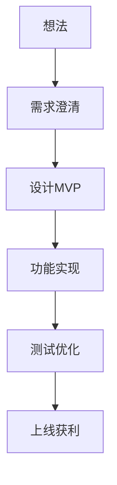
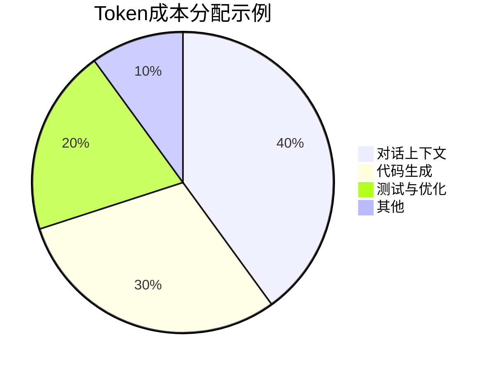

# 从想法到产品：Codex、Cursor、Claude Code 全流程指南

**执行摘要：** 本报告系统梳理了从想法到可用产品的全流程方案，涵盖项目规划、分工、对话流程、优化与验证等方面。首先，须**定义项目里程碑和MVP**，明确产品核心功能和最小可行闭环。每个阶段要有详细步骤和对话提示模板，包括需求澄清、信息架构、组件设计、功能实现、集成测试、UI优化、可用性测试和上线获利等。针对UI/产品质感，应建立设计系统和样式规范，并通过自动化对比（如截图Diff）保证一致性。代码质量需由**分支管理、CI/CD流水线和自动化测试**等手段保障（如GitHub Actions集成AI审查、使用AI生成单元测试）。为了节省Token和时间，应利用上下文缓存和代码检索插件（如语义搜索MCP）来降低Token消耗。报告还列出了所需技能（UI/产品设计、前后端开发、测试、运维、商业化等），以及每种技能在AI角色（规划者/实现者/审查者）中的任务与验收标准。最后附上可复用的对话示例库与检查表格、流程图和预算示例等，并推荐了官方文档和专业资料作为参考。假设项目无特定技术栈和资源限制。

## 项目里程碑与最小可行产品（MVP）定义与示例

- **里程碑**：将项目分解为若干关键阶段，每阶段围绕一个明确目标展开（如需求调研、架构设计、功能开发、测试上线等）。在初期应聚焦**核心闭环**，即实现核心场景的端到端流程。例如，一个待办应用的MVP里程碑可以定义为“用户登录→创建任务→查看列表→登出”，确保基础功能可用。后续里程碑再依次加入附加功能（如任务分享、推送提醒等）。
- **MVP定义**：最小可行产品是只包含核心功能的产品版本，用最小投入验证想法。其目的是快速上线获取用户反馈，指导后续迭代。在MVP阶段，只实现解决**早期用户核心痛点**所需的基本功能，不引入额外花哨特性。例如，电商应用MVP可只包含商品浏览、下单支付，不必一开始就开发推荐算法或多语言支持。
- **示例**：以“社交笔记App”为例，里程碑可设为：  
  1. **需求澄清与设计MVP**：确定用户群（如学生、白领）、解决核心需求（记录和分享笔记）、拟定核心功能（笔记创建、编辑、阅读）。  
  2. **搭建基础架构**：建立项目框架、数据库模型、关键API接口。  
  3. **实现主要页面**：开发登录页、笔记列表页、新建笔记页等。  
  4. **功能联调与测试**：串联前后端，确保笔记增删改查功能完整。  
  5. **UI优化与可用性测试**：完善界面风格，邀请用户试用收集反馈。  
  6. **上线与商业化**：部署到生产环境，探索获利模式（如会员、广告）。  
每个里程碑明确**验收标准**（如关键功能可用、无严重bug），完成后再进入下阶段，避免一步到位导致目标不清。

## 里程碑阶段详细步骤与对话模板

针对每个里程碑，应制定清晰的对话策略和提示词，确保AI按需求执行并主动确认关键信息。以下为主要阶段的示例流程：

- **需求澄清阶段**  
  - **目标**：明确产品定位、目标用户、核心功能和成功指标，完善PRD（产品需求文档）。  
  - **步骤**：引导AI生成产品需求草案，并让AI主动提出问题澄清用户流程。  
  - **示例提示词**：`“请根据以下想法撰写产品需求文档：目标用户是谁？要解决什么问题？核心功能有哪些？给出主要页面和交互流程。”`  
  - **确认点**：要求AI在信息不明确时提问（如“系统主要用户及行为是什么？有没有指定技术栈？”），并禁止AI自行添加未确认的功能。  
  - **约束语句**：在提示中加入类似“**不要自行拓展功能，必要时向我提问**”的说明，确保AI仅在明确指令下执行。  
  - **验收标准**：生成的PRD应包含用户画像、功能列表、用户流程图等要素；若AI输出笼统或遗漏关键项，需补充提问至达标。

- **信息架构阶段**  
  - **目标**：根据需求文档设计信息架构，确定网站/应用的主要页面、模块和组件清单。  
  - **步骤**：请求AI列出页面列表和层级结构，如首页、详情页、设置页等；再让AI细化各页面需包含的组件。  
  - **示例提示词**：`“根据产品需求文档，列出所有必要的页面及其功能模块。例如：首页、个人中心、笔记列表页等，并简要描述每个页面的主要功能。”`  
  - **验收标准**：页面清单应覆盖核心用户场景（登录、主功能页、设置等）；每个页面要有组件描述。例如任务列表页需含“任务项组件”、“新建按钮”；若遗漏关键页面，需要求AI补充。

- **组件清单阶段**  
  - **目标**：为每个关键页面列举具体UI组件和子功能，准备开发清单。  
  - **步骤**：逐页面询问AI：“XX页面需哪些组件？”，让AI输出组件列表（如按钮、表单、列表、图表）。  
  - **示例提示词**：`“请为‘笔记编辑页面’列出所需的UI组件（如文本输入框、保存按钮、标签列表等），并说明每个组件的作用。”`  
  - **验收标准**：组件清单应细致可执行，避免过于抽象。如“输入框”要具体到“标题输入框、内容编辑器”；组件作用说明清晰。

- **单页实现阶段**  
  - **目标**：让AI根据组件清单编写单个页面的代码（HTML/CSS/JS或框架代码）。  
  - **步骤**：指示AI生成具体页面代码，并要求输出可运行的代码片段。  
  - **示例提示词**：`“请为‘笔记列表页面’生成前端代码，使用HTML和CSS（或React组件），要求能展示标题列表和新建笔记按钮。”`  
  - **验收标准**：AI输出的代码应能够编译运行，无明显语法错误，并基本符合设计要求。代码风格可通过Lint校验；如不符合规范或无法运行，则返回修正提示。

- **联调与测试阶段**  
  - **目标**：将前端页面与后端接口连接，并编写或执行相关测试。  
  - **步骤**：让AI修改代码完成后端交互（如登录验证、数据加载），并使用测试框架（如Playwright、Jest）验证功能。  
  - **示例提示词**：`“将登录表单与后端验证集成，请编写API调用代码并添加表单校验逻辑，最后生成一段用于测试登录成功与失败情况的脚本。”`  
  - **验收标准**：功能测试脚本运行通过，关键流程正常（如登录成功进入主界面）。若测试失败，提示AI定位并修复问题。

- **UI 优化阶段**  
  - **目标**：提高界面美观度和一致性，落实设计系统。  
  - **步骤**：让AI根据设计规范（颜色、间距、字体）审查并调整UI代码，可以利用图片差异工具自动化检查界面差异。  
  - **示例提示词**：`“现有登录页布局较为杂乱，请根据设计规范（蓝色主色、统一圆角按钮、16px字体）调整CSS，使样式统一且界面简洁。”`  
  - **验收标准**：检查点包括对齐无误、配色符合规范、无元素重叠等。可通过对比设计稿和截图来验证（如使用 Playwright 截图并Diff）。发现差异则指导AI继续改进。

- **可用性测试阶段**  
  - **目标**：模拟真实用户操作，检查使用便捷性与易用性。  
  - **步骤**：设计用户测试任务（如“创建新笔记”、“修改笔记标题”），并让AI扮演测试员执行，反馈改进意见。  
  - **示例提示词**：`“假设你是用户，按照‘创建、保存笔记’的流程操作，记录下使用中的困难或UI问题。请输出一份测试报告，提出优化建议。”`  
  - **验收标准**：报告应涵盖关键流程的用户体验问题（按钮是否明显、流程是否顺畅等），并提出具体改进方向。

- **上线与获利阶段**  
  - **目标**：部署项目上线并规划商业化。  
  - **步骤**：让AI生成部署方案（选择云服务、设置CI/CD流水线），并分析商业模式（例如订阅、内购或广告）。  
  - **示例提示词**：`“请制定部署流水线方案，包括代码托管平台和自动化脚本。随后给出两种可行的商业化策略，并简要分析优劣。”`  
  - **验收标准**：部署方案涵盖环境配置和自动化步骤；商业方案覆盖收益来源和成本预估。若方案过于笼统，需要求AI补充细节。

每阶段都要明确**输入/输出**和**关键验收点**。对话中可采用多轮提问：例如先让AI生成方案草稿，再针对草稿细化或修正，并让AI主动复述确认要点。始终强调不要擅自扩展需求，保持与先前输出一致。

## 必用技能列表及AI角色分工

实现完整产品需要多种技能，每种技能在AI流程中可扮演不同角色，主要分为**规划者（规划）**、**实现者（实施）**、**审查者**。下表列出了常见技能及各角色的任务与验收标准。

| 技能        | 规划者（任务 / 验收）                                                          | 实现者（任务 / 验收）                                            | 审查者（任务 / 验收）                                            |
|-----------|------------------------------------------------------------------------|---------------------------------------------------------------|---------------------------------------------------------------|
| **产品设计** | - 制定用户需求与功能清单（PRD） - 验收：PRD完整覆盖用户需求，无歧义                 | - 转化PRD为用户故事或线框图 - 验收：输出原型或演示，符合需求         | - 审核PRD和原型逻辑一致性 - 验收：需求符合业务目标，无遗漏           |
| **UI设计**   | - 定义设计系统（颜色、字体、组件库） - 验收：设计规范文档包括视觉要素         | - 编写界面代码，实现UI界面 - 验收：界面布局和样式符合规范，可运行无错 | - 视觉审查界面一致性与易用性 - 验收：界面无错位、元素风格统一，符合美学   |
| **前端开发** | - 选定前端技术栈并设计组件架构 - 验收：提供系统架构图和技术方案                     | - 编码实现页面和交互功能 - 验收：功能完成度高，代码通过静态检查       | - 代码审查和性能测试 - 验收：符合编码规范、无性能瓶颈，测试覆盖率满足要求 |
| **后端开发** | - 设计后端架构、接口和数据库模式 - 验收：提交API文档和数据库ER图                   | - 编写服务端代码，实现API逻辑 - 验收：接口正常工作，通过接口测试       | - 审核后端安全和可靠性 - 验收：代码安全无漏洞，接口响应正确               |
| **测试**     | - 制定测试计划和用例（单元测试、集成测试） - 验收：测试用例文档齐全合理             | - 编写自动化测试脚本并执行 - 验收：所有测试用例通过，无严重缺陷       | - 评估测试覆盖率和结果 - 验收：关键路径100%覆盖，bug追踪处理完善       |
| **部署/运维** | - 规划部署流程（选择CI/CD工具、云平台） - 验收：部署方案文档明确可行             | - 配置CI/CD流水线并部署 - 验收：部署成功，线上环境稳定运行           | - 检查自动化流程和安全性 - 验收：回滚机制可用，无漏网风险               |
| **可用性评估** | - 设计用户测试方案 - 验收：测试指标和任务场景清晰                            | - 执行可用性测试并记录反馈 - 验收：生成用户反馈报告，数据完整         | - 分析测试结果并提出改进 - 验收：明确改进清单，并指导下一步优化           |
| **商业化/获利** | - 制定商业模式（收入来源、定价策略） - 验收：方案可行、有数据支持                    | - 实现支付系统或广告接口 - 验收：支付流程测试通过，可接受支付        | - 评估盈利模型与成本 - 验收：商业逻辑合理，可持续运营                    |

每个角色的**输出成果**应明确，例如：规划者提交文档、实现者提交功能代码、审查者提交评审报告等，且要有具体的验收标准保证质量。

## 基于Codex、Cursor、Claude Code的分工建议

Codex、Cursor、Claude Code各有特点，可相互补充：  

- **Cursor（IDE 插件型）**：擅长日常编码与流畅交互。当需求较为明确或需快速编写代码时，Cursor在编辑器内通过**Tab补全和内联编辑**提升效率。它支持多模型切换（如GPT4o、Claude、Gemini）和`.cursorrules`项目级指令。建议：在开发单一页面或组件时优先使用Cursor，负责编写和优化代码。Cursor在VSCode中直观易用，可快速响应代码补全。其弱项是对极大项目整体结构理解不足，复杂跨文件重构时可能出错。
- **Claude Code（终端CLI型）**：擅长复杂任务和跨文件重构。它在终端环境中运行，可以**直接读写文件、执行Shell命令和跑测试**。Claude Code拥有**200K token**的大上下文窗口，适合整体扫描项目并进行大规模修改。推荐：用Claude Code处理**大型重构、代码审查和生成项目文档**等场景，例如批量修改字段、拆分模块或自动审核代码质量。Claude Code也支持MCP插件和Hooks（可挂载定制工具）来优化流程。弱项是在实时交互方面体验较差，不如Cursor顺畅；对于简单任务或新代码编写，效率略逊一筹。
- **Codex（云端异步代理）**：擅长**并行批量执行任务**。新版Codex在云端沙箱执行任务，提交后可以自动创建PR并行处理多个请求。它的优势是高度自动化：用户发出任务后可离开去做其他事，完成后收到结果。推荐使用Codex来**批量修改代码、自动生成Pull Request**或完成定型化任务（如全项目搜索替换、统一格式调整）。Codex的弱项是无法实时交互或跟踪细节，需要依赖正确的指令和API调用；而且功能齐全需要较高订阅费用。使用时注意提供足够上下文或依托已有配置，如在`.codex/config.toml`设定项目根目录文件（类似Claude Code的claude.md）来启动Agent。

**调用示例与上下文管理技巧**：

- *Cursor 示例*：在VSCode里使用Chat窗口，或Ctrl+K触发内联编辑。可在`.cursorrules`文件中预设提示令牌，比如`"style": "bootstrap4"`等来保持一致。遇到上下文过长时，可借助Cursor的代码索引（`@codebase`指令）或多模型并行方式，避免一次对话超过token限制。
- *Claude Code 示例*：在终端运行`claude`，比如使用`/feature-dev`工作流命令自动执行端到端功能开发。使用CLI可通过`/save`或`/memory`命令保存会话上下文。为节省Token，可启用“Prompt Caching”功能（复用响应片段）和外部检索插件，将项目代码做向量索引检索。
- *Codex 示例*：调用`codex code` CLI并传入任务描述（或直接用`codex app`桌面客户端），可在请求头中附带项目路径信息，让Codex自动识别仓库内容。建议使用Codex的并行执行功能，同时提交多个重构任务，以其并行能力最大化效率。
- **节省Token与上下文一致**：可利用**语义搜索MCP插件**（如 [claude-context](https://github.com/zilliz/claude-context)）构建向量数据库，仅将相关代码段拉入上下文查询，实验表明可节省60–75%Token。另外，通过制定固定问答套路（Prefix）让会话保持一致，比频繁清空会话更高效。对于长会话，可在重要节点手动更新项目`claude.md`或`prompt`以让AI“记忆”关键进展。

## 详细对话流程模板（按阶段）

下面提供各阶段的对话模板示例，包括输入/输出、提示词和验收要点：

- **阶段1：需求澄清**  
  - **输入**：用户最初需求，如“我要做一个笔记App”。  
  - **AI输出**：初步PRD草案（用户画像、核心需求、功能列表）。  
  - **示例提示**：`“请根据以下想法输出一份产品需求文档，说明目标用户、解决的问题、核心功能和成功指标。如果信息不足，请最多提3个问题确认。”`  
  - **输出验收**：文档包含“谁使用、做什么、为什么做”三要素。  
  - **失败模式**：输出过泛或遗漏关键场景。**应对**：提示AI针对遗漏点提问，补充需求细节。

- **阶段2：信息架构**  
  - **输入**：确认后的产品需求文档。  
  - **AI输出**：网站/应用页面结构（页面列表及功能说明）。  
  - **示例提示**：`“根据PRD，列出所有必要页面和它们的子模块。例如：‘主页：显示笔记列表’，‘登录页：输入用户名密码’等。”`  
  - **输出验收**：包含核心页面（如主页、详情页、设置页）和功能描述，缺失时补齐。  
  - **失败模式**：缺少主要页面或功能描述过简。**应对**：要求AI检查是否覆盖所有用户流程。

- **阶段3：组件清单**  
  - **输入**：页面结构设计结果。  
  - **AI输出**：每个页面需要的具体UI组件清单。  
  - **示例提示**：`“‘笔记列表页’需要哪些UI组件？请列出组件名称及用途（如任务项、删除按钮、加载指示器等）。”`  
  - **输出验收**：组件名称和功能详细，能指导实现。  
  - **失败模式**：组件过于概括。**应对**：要求明确组件属性和行为，如“标题组件”、“编辑按钮”。

- **阶段4：单页实现**  
  - **输入**：目标页面信息和组件列表。  
  - **AI输出**：具体页面实现代码（HTML/CSS/JS或框架组件）。  
  - **示例提示**：`“请编写‘笔记详情页’的前端代码（包括布局和样式），要求能显示笔记标题和内容。”`  
  - **输出验收**：代码无语法错误并可运行；界面基本符合设计。  
  - **失败模式**：代码不完整或布局混乱。**应对**：提醒AI运行测试或分步生成，逐步完善代码。

- **阶段5：集成测试**  
  - **输入**：实现页面的代码和后端接口。  
  - **AI输出**：代码修改（如补充API调用）及测试脚本。  
  - **示例提示**：`“请将登录表单与后端登录API对接，并用Playwright编写一个测试脚本验证登录功能。”`  
  - **输出验收**：前后端连通正常；测试脚本运行通过。  
  - **失败模式**：登录失败或测试报错。**应对**：提示AI查看日志定位问题，调整接口调用或测试代码。

- **阶段6：UI优化**  
  - **输入**：当前UI效果（可附截图）和设计规范。  
  - **AI输出**：优化后的界面代码或样式改动说明。  
  - **示例提示**：`“根据设计规范（主色#1E90FF，16px字体、8px间距），请优化下面登录页的样式，使界面更美观。”`  
  - **输出验收**：视觉检查：无错位、配色统一。可使用自动化截图对比验证差异。  
  - **失败模式**：布局仍有问题。**应对**：提示AI重新调整CSS规则，或复位某些样式。

- **阶段7：可用性测试**  
  - **输入**：完成的产品功能。  
  - **AI输出**：用户测试报告或体验反馈。  
  - **示例提示**：`“模拟用户进行‘新增笔记’操作，记录界面流程和发现的问题，并提出3条改进建议。”`  
  - **输出验收**：报告包含流程说明和具体反馈点，建议可落地实施。  
  - **失败模式**：测试报告泛泛无具体建议。**应对**：指导AI关注用户情感和效率等指标再次执行。

- **阶段8：上线与获利**  
  - **输入**：完整产品源码。  
  - **AI输出**：部署脚本和商业计划。  
  - **示例提示**：`“为项目创建CI/CD配置（例如GitHub Actions），并分别给出按订阅和广告两种模式的商业计划概要。”`  
  - **输出验收**：CI/CD能自动构建部署；商业方案逻辑清晰，有成本和收益分析。  
  - **失败模式**：计划缺少关键步骤或考虑不足。**应对**：要求AI给出更详细的步骤和估算数据。

## UI视觉与产品感可控方法

- **设计系统与样式规范**：在项目初期制定全局设计系统（品牌色、字体、间距、组件样式等），并作为AI的**固定输入**。例如提供设计系统文档或样式指南给AI参考，避免每次生成时都创新样式。  
- **审美检查清单**：列出界面评审要点（配色对比度、组件对齐、字体一致性、响应式适配等），对AI输出的UI进行自检或让AI充当审查者检查界面。  
- **截图Diff纠正**：结合自动化测试工具（如Playwright）生成关键页面的截图，并与设计稿做像素或视觉差异比较。若发现偏差，让AI基于截图差异说明继续调整样式。这一循环能有效收敛视觉偏差。  
- **视觉统一示例**：在提示中引用典型界面示例（或样式参考图），让AI知晓期望风格。例如“请参考下方界面样式改进按钮颜色和字体”。这比口头描述更易传达审美要求。  

通过以上方法，可让AI在视觉层面输出更一致、更具产品感的界面。

## 代码质量与稳定性保障策略

- **分支管理与回滚**：严格遵循“功能分支”开发原则，**不直接在主分支提交**。每完成一项功能后发起PR，CI通过后合并。若新功能出问题，可通过回退PR或分支回滚快速恢复。  
- **自动化测试**：利用AI辅助生成测试用例。GitHub Copilot等工具可自动生成单元测试脚本。建议为核心功能编写单元和集成测试，确保代码改动不破坏现有功能。每次提交都由CI运行这些测试。  
- **CI/CD流水线**：建立持续集成管道，自动执行构建、测试和部署过程。如使用GitHub Actions，可在每次PR后自动运行Lint、单元测试，并对AI代码更改进行自动审查。持续部署可以在测试通过后自动推送上线，确保快速可靠交付。  
- **质量审查钩子**：在AI生成代码后，应进行人工或AI辅助的审查。可以定制Lint和格式化工具自动检查，利用Claude Code的**Hooks**功能在代码生成前后跑测试和静态分析。如发现问题，及时在项目文档(`claude.md`或prompt文件)中添加注意事项，防止重复错误。  
- **测试用例模板**：为常见模块预先准备测试用例模板，例如用户认证、输入校验、异常处理等，让AI在对应阶段补全或更新测试用例。这样能保证每个新功能都有覆盖到关键路径的测试。  
- **监控和日志**：上线后部署监控（日志、错误上报、性能指标），AI可参与分析异常日志帮助定位问题。必要时用AI插件自动回溯代码改动，从而快速回滚或修复。

## Token与时间成本优化技巧与估算

- **上下文缓存**：充分利用长会话和提示缓存机制。Claude Code等框架支持**提示缓存**（Prompt Caching），重用会话中的前一结果减少重复计算。保持对话会话活跃而不是频繁重启，新上下文可直接关联旧的prompt，节省大量Token。  
- **语义检索插件**：引入代码检索MCP插件（如`claude-context`）可将整个代码库向量化索引，仅将相关代码片段拉入AI上下文。实测47万行代码时，Token使用量降低约75%。Cursor和Codex也能接入类似检索服务，避免“一次性读入所有文件”导致的浪费。  
- **任务并行与等待**：使用Codex的并行提交能力，将耗时任务分摊至等待时间，例如：“创建5个重构任务，开会回来时再收集结果”。这样可以在等待AI执行时进行其他工作，提高时间利用率。  
- **Prompt精简**：提示中尽量使用引用和变量替换（如`{{variable}}`）以减少重复文字。对相似任务，可采用**prompt模板**并注入参数，而非每次完全重新描述。  
- **估算示例**：可将任务分为阶段并预算Token/时间。例如：  
  - 需求阶段：生成PRD约需5000 token，人工1小时。  
  - 架构设计：列出页面和组件约2000 token，0.5小时。  
  - 代码生成：每个主要页面约3000–5000 token，2小时开发+调试。  
  - 测试和优化：每阶段测试脚本2000 token，1小时。  
  - 迭代优化：UI调整和测试各1000 token，0.5小时。  
  - 合计：假设总Token消耗10万，使用以上插件可减至3万；AI生成占80%，人工校正20%。根据API定价或订阅，可估算货币成本和时间投入（可做成表格）。例如，20美金Codex订阅/月能支持约50万token（假设），则本项目Token费约2美元。时间方面，AI生成+人工检查每周可交付一个小里程碑。

## 可复用对话示例库与检查清单

| 阶段        | 示例提示（Prompt）                             | 预期输出                                | 验收标准                           |
|-----------|---------------------------------------------|--------------------------------------|----------------------------------|
| 需求澄清     | “基于想法X，生成产品需求文档，包括用户/功能/指标。”        | 含目标用户、痛点、功能清单的PRD文档          | 包含用户画像、问题描述、核心功能列表         |
| 信息架构     | “根据需求列出所有页面和模块，如登录页、主页等。”           | 页面列表及每页功能描述                     | 页面覆盖所有核心流程（登录、主页、详情页等）   |
| 组件清单     | “请为Y页面列出UI组件清单及用途，如按钮、表单字段。”        | 详细的组件名称和功能说明                    | 组件名称准确具体，包含所有必要元素            |
| 单页实现     | “请生成X页面的前端代码（HTML/CSS/JS）。”                 | 页面代码片段                            | 代码可运行，界面布局基本正确                |
| 功能联调测试   | “实现登录功能并用测试脚本验证。”                        | 登录接口代码和测试脚本                     | 登录成功/失败场景测试通过                    |
| UI优化      | “优化下面页面样式，使其符合设计规范（颜色、排版等）。”        | 修正后的CSS样式或截图差异报告                | 界面无错位，颜色/字体符合设计要求            |
| 可用性测试    | “模拟用户执行功能流程，输出发现的问题和改进建议。”          | 用户流程报告和问题反馈列表                    | 覆盖主要流程，有针对性的改进建议            |
| 上线部署     | “制定部署流水线脚本并简述商业化方案。”                    | CI/CD配置示例和商业计划概要                  | 部署脚本可自动执行，商业方案可落地（有盈利逻辑） |

以上示例提示可根据实际场景微调。每个输出都应根据**验收标准**检查：若不符合标准，需重新提示AI改进。

## 推荐资源与参考来源

- **官方文档**：OpenAI Codex CLI 仓库及文档；Cursor 官方文档；Anthropic Claude Code 文档；红帽（Red Hat）DevOps/CD 文档。  
- **原始论文与权威资料**：Atlassian关于MVP的介绍；GitHub Copilot测试指南；Cloud.tencent.com 开发者社区（张丹Cloud、码哥等撰写的《Codex vs Cursor vs Claude Code》对比分析；苏米客（xmsumi）关于Cursor Agent实践的详解等。  
- **中文教程与博客**：GitCode/CSDN上的教程（如《实现你的Workflow》详细流程、GitHub Copilot使用案例）；国内外社区文章和知乎专栏心得。  
- **工具和框架**：Playwright、Jest 等测试框架官方指南；CI/CD 平台（GitHub Actions、Jenkins）文档；设计系统和风格指南参考（如Ant Design、Material Design 规范）。  

本报告引用上述资料来说明方法和原则，希望帮助读者构建系统、可控的AI辅助开发流程。所列资源优先官方与权威中文资料，以便深入阅读和实践。